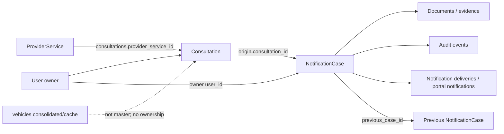
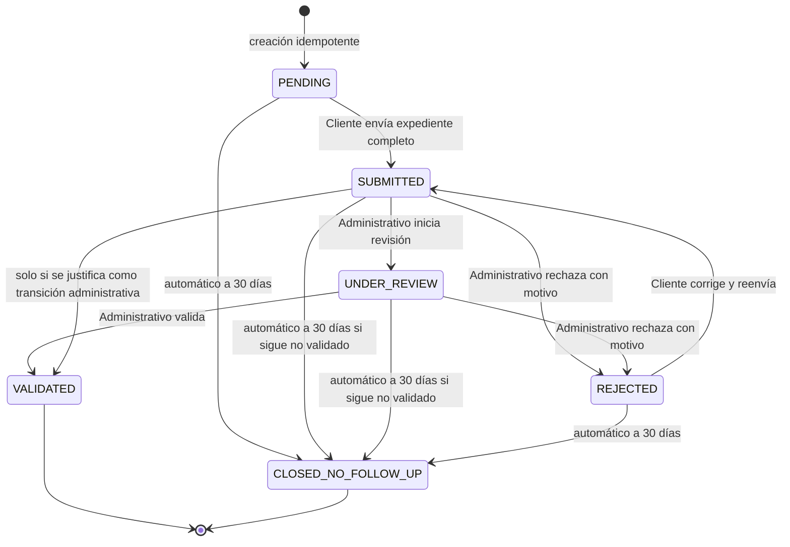

# VINTrack — SPRINT-01: Domain & Data Model Design

**Estado del Sprint:** APPROVED — OBSERVATIONS RESOLVED  
**Tipo:** Diseño y documentación exclusivamente  
**Fecha de autorización:** 2026-08-12  
**Baseline:** Fase 0 v1.0 aprobada; SPRINT-00 aprobado con observaciones  
**Resultado obligatorio:** `docs/sprints/SPRINT-01-RESULT.md`

---

## 1. Instrucción principal para Codex

Actúa como **Senior Software Architect, Domain Modeler, Database Architect para MySQL/MariaDB, Application Security Architect y Senior Laravel 12 Developer**.

Debes inspeccionar el repositorio real de VINTrack y producir el diseño definitivo del dominio y del modelo de datos para el proceso de expedientes de notificación vehicular. El diseño debe respetar la arquitectura, convenciones y evidencia descubiertas en Fase 0 y SPRINT-00.

Este Sprint termina con documentación revisable. **No implementes nada.** No conviertas las propuestas de este documento en código, migrations ni cambios de base de datos.

### 1.1 Resultado que debe lograr el Sprint

Entregar una especificación sin ambigüedades que permita que un Sprint posterior implemente, tras aprobación del Project Owner:

- expedientes vinculados a consultas positivas;
- ownership seguro por usuario/cliente;
- captura y corrección administrativa del expediente;
- máquina de estados canónica;
- reglas temporales de 3, 30 y 90 días;
- control de concurrencia e idempotencia;
- documentos/evidencia privada;
- auditoría inmutable;
- notificaciones por correo y dentro del portal;
- historial del Cliente y vista global administrativa mediante DataTables server-side;
- automatización compatible con cPanel Cron;
- persistencia compatible con MySQL 8.4.3 y MariaDB 10.6.27.

### 1.2 Regla de evidencia

No inventes la estructura existente. Toda afirmación sobre el sistema actual debe citar evidencia verificable: archivo, clase, método, ruta, tabla, columna, índice, migration o configuración. Si algo no puede comprobarse, márcalo como `NO DETERMINADO`, explica la evidencia faltante y presenta una recomendación claramente identificada como propuesta.

---

## 2. Límites estrictos del Sprint

### 2.1 Únicas modificaciones permitidas

Se permite crear o actualizar solamente:

```text
docs/sprints/SPRINT-01-RESULT.md
```

Si la gobernanza del repositorio obliga a actualizar un índice o estado documental del Sprint, detente y repórtalo como propuesta: no lo modifiques sin autorización expresa.

### 2.2 Prohibiciones absolutas

No debes:

- crear, modificar ni ejecutar migrations;
- crear o modificar tablas, columnas, índices, constraints, triggers, datos o catálogos;
- crear código PHP, JavaScript, CSS, Blade, SQL, tests, seeders, factories, comandos, jobs o endpoints;
- modificar modelos, controladores, servicios, repositorios, rutas, requests, policies, permisos o vistas;
- modificar la lógica de consultas, créditos o proveedores;
- crear directorios de almacenamiento ni subir archivos;
- configurar o ejecutar Cron Jobs, colas o Scheduler;
- instalar o actualizar dependencias;
- cambiar `.env`, configuración local o producción;
- conectarte o desplegar a producción;
- usar pseudocódigo ejecutable como sustituto de una implementación futura;
- presentar una propuesta física como si ya existiera.

Puedes usar diagramas, tablas, DDL conceptual no ejecutable y firmas conceptuales, siempre etiquetados como **DISEÑO PROPUESTO — NO IMPLEMENTADO**.

---

## 3. Documentación y evidencia obligatorias

Antes de diseñar, lee completamente, cuando existan:

```text
AGENTS.md
docs/VINTRACK_MASTER_SPEC.md
docs/ARCHITECTURE.md
docs/BUSINESS_RULES.md
docs/DATA_MODEL.md
docs/DECISION_LOG.md
docs/CHANGE_REQUESTS.md
docs/PROJECT_STATE.md
docs/sprints/SPRINT-00-DISCOVERY.md
docs/sprints/SPRINT-00-RESULT.md
```

Después inspecciona solamente lo necesario del código y migrations para verificar convenciones y baseline. La documentación aprobada manda sobre borradores; los hallazgos del código mandan sobre suposiciones técnicas. Si código y documentación aprobada se contradicen, no elijas silenciosamente: registra la contradicción, impacto y recomendación.

### 3.1 Baseline ya aprobado que no debe rediscutirse

- Proyecto: Laravel 12 y PHP 8.3.
- Desarrollo local: MySQL 8.4.3, InnoDB, `utf8mb4`.
- Producción: MariaDB 10.6.27, InnoDB, `utf8mb4`, hosting compartido cPanel, sin SSH ni consola PHP interactiva.
- Campo canónico existente: `consultations.provider_service_id` **en singular**.
- `consultations` conserva la relación directa con usuario, proveedor y servicio del proveedor.
- `vehicles` funciona como consolidado/cache del último estado conocido; no es la entidad maestra del nuevo proceso.
- Existe infraestructura reutilizable de correo (`NotificationPolicy`, `NotificationDelivery`, `CustomerMailNotificationService`) y deduplicación por `dedup_key`, según SPRINT-00; debe verificarse sin duplicarla.
- No existe baseline confirmado de notificaciones dentro del portal; deben diseñarse.
- Los DataTables actuales cargan/paginan en cliente; las nuevas vistas deben diseñarse para procesamiento server-side.
- `wallet_ledger.correlation_id` constituye un precedente de idempotencia, no una tabla que deba reutilizarse fuera de su propósito.
- La consulta bloqueada por tres pendientes debe detenerse antes del débito y antes de invocar al proveedor.
- Fase 0 está aprobada y SPRINT-00 no debe repetirse.

---

## 4. Lenguaje ubicuo y fronteras del dominio

Usa de forma consistente estos conceptos:

| Concepto | Definición contractual |
|---|---|
| Consulta (`Consultation`) | Operación existente realizada por un usuario contra un servicio de proveedor. Puede ser positiva o negativa. |
| Expediente de notificación (`NotificationCase`) | Proceso originado, cuando las reglas lo permiten, por una consulta positiva. Es independiente del historial de consultas. |
| Owner / Cliente responsable | El registro `User` que realizó la consulta originadora (`consultations.user_id`). No crear una entidad Cliente paralela. |
| Usuario cliente/policía | Usuario cuyo tipo de rol satisface la regla existente `User → Role → RoleType.is_customer`; actúa sobre expedientes propios. |
| Usuario administrativo | Usuario con tipo de rol/permiso administrativo; puede ver el historial global, corregir campos permitidos y ejecutar transiciones manuales autorizadas. |
| Analista | Actor administrativo con permiso para revisar, rechazar y validar. No modelarlo como owner del expediente. |
| Snapshot vehicular | Copia histórica de datos relevantes. VIN es automático cuando existe; solo un borrador por placa sin VIN recuperable permite primera asignación auditada, tras la cual es inmutable. |
| Pendiente | Expediente cuyo estado no es `VALIDATED` ni `CLOSED_NO_FOLLOW_UP`. |
| Evidencia | Archivo privado asociado a un expediente, sujeto a validación y autorización. |
| Evento de auditoría | Registro append-only de una acción, transición o cambio relevante. |

### 4.1 Separación obligatoria de agregados



Reglas:

1. Una consulta puede existir sin expediente.
2. Un expediente debe tener exactamente una consulta originadora.
3. La FK del expediente hacia la consulta debe ser `consultation_id`.
4. El servicio del proveedor se obtiene mediante la relación directa `consultations.provider_service_id`; no diseñar una relación indirecta a través de `vehicles`.
5. El owner se fija desde `consultations.user_id` al crear el expediente y no cambia.
6. No crear tablas `clients`, `customers` o equivalentes para duplicar la identidad de `users`.
7. `vehicles` no puede ser owner, raíz de agregado ni fuente de verdad histórica del expediente.

---

## 5. Identidad, ownership y autorización

El diseño debe demostrar cómo se impide el acceso horizontal (IDOR) aunque se manipulen IDs, folios, VIN o URLs.

### 5.1 Reglas obligatorias

- Portal Cliente: consultar, editar o descargar únicamente recursos cuyo `notification_cases.user_id` sea el usuario autenticado, salvo la vista limitada de existencia/estado autorizada para un expediente de otro usuario.
- Portal Administrativo: acceso global solamente mediante permisos administrativos explícitos; no basta un parámetro de interfaz.
- Toda query, detalle, descarga y mutación debe aplicar autorización server-side.
- La consulta de Policía B se registra normalmente, pero no transfiere ownership ni crea co-ownership sobre el expediente de Policía A.
- La vista para Policía B no debe filtrar evidencia, datos personales, notas internas ni información no autorizada. Diseñar una proyección mínima segura.
- Folio visible y `id` técnico no son controles de autorización.

El resultado debe incluir una matriz `actor × recurso × acción × condición` para, como mínimo: listado, detalle, captura, edición, envío, revisión, rechazo, validación, descarga de evidencia, carga/eliminación de archivo, consulta de auditoría y navegación al expediente anterior.

### 5.2 Catálogo conceptual aprobado

Diseñar, sin implementar, los permisos: `case.view.own`, `case.view.global`, `case.edit.own`, `case.edit.admin`, `case.submit`, `case.review.start`, `case.reject`, `case.validate`, `case.document.manage.own`, `case.document.manage.global`, `case.audit.view`, `case.vin.assign_once`, `case.vin.reconciliation.manage`, `case.notification.supervise`, `case.automation.supervise`, `case.configuration.manage`, `case.permissions.manage`.

Cliente/Policía tiene scope propio, submit/reenvío/documentos propios y asignación VIN una vez en la excepción. Analista tiene vista global, revisión, corrección permitida, rechazo, validación, documentos/auditoría y participación en conciliación según permiso. Administrador Global añade permisos/configuración/supervisión/conciliación. Nadie puede alterar silenciosamente VIN asignado, folio, owner, consulta/criterio/valor, seleccionar manualmente `CLOSED_NO_FOLLOW_UP` o borrar historia sin política legal.

---

## 6. Identificadores y folio

Diseñar dos identificadores diferentes:

| Campo conceptual | Regla |
|---|---|
| `id` | PK técnica `BIGINT` (o convención equivalente comprobada), interna, estable. |
| `case_number` / folio visible | Único, público, legible, inmutable, nunca reutilizado. Formato conceptual `NT-2026-000001` o prefijo VINTrack justificado. |

El formato final debe ser propuesto a partir de las convenciones reales. El diseño debe garantizar unicidad bajo concurrencia, incluidos dos procesos que creen expedientes simultáneamente, sin depender de `MAX(id)+1`. Debe explicar:

- scope y reinicio o no de la secuencia anual;
- longitud y capacidad;
- constraint único;
- asignación transaccional;
- comportamiento ante rollback, huecos y reintentos;
- idempotencia de la creación;
- por qué funciona igual en MySQL 8.4.3 y MariaDB 10.6.27.

El folio nunca puede editarse. El VIN no puede modificarse una vez asignado; la única excepción es su primera asignación por el owner en un borrador originado por placa sin VIN recuperable.

---

## 7. Snapshot del vehículo y formulario del expediente

Al crear el expediente, tomar un snapshot de los datos relevantes disponibles en la consulta originadora. Los valores precargados son defaults históricos, no una dependencia viva de `vehicles`. Marca, modelo, año y otros campos editables pueden corregirse. VIN es inmutable desde su asignación inicial; solo puede estar temporalmente vacío y asignarse una vez en la excepción de placa aprobada.

### 7.1 Matriz contractual de campos

| # | Campo funcional | Nombre conceptual sugerido | Obligación al enviar | Cliente/Policía | Administrativo |
|---:|---|---|---|---|---|
| 0 | Folio automático | `case_number` | Automático | Solo lectura | Solo lectura |
| 1 | VIN | `vin` | Sí; automático salvo excepción de placa | Asigna una vez solo en borrador de placa sin VIN; después solo lectura | Solo lectura; conciliación por procedimiento futuro autorizado |
| 2 | Lugar de recuperación | `recovery_place` | Sí | Edita mientras estado lo permita | Corrige con auditoría |
| 3 | País | `country` | Sí | Edita mientras estado lo permita | Corrige con auditoría |
| 4 | Estado | `state` | Sí | Edita mientras estado lo permita | Corrige con auditoría |
| 5 | Alcaldía/Municipio | `municipality` | Sí | Edita mientras estado lo permita | Corrige con auditoría |
| 6 | Colonia | `neighborhood` | No | Edita mientras estado lo permita | Corrige con auditoría |
| 7 | Código postal | `postal_code` | No | Edita mientras estado lo permita | Corrige con auditoría |
| 8 | Calle | `street` | No | Edita mientras estado lo permita | Corrige con auditoría |
| 9 | Número | `street_number` | No | Edita mientras estado lo permita | Corrige con auditoría |
| 10 | Fecha y hora de recuperación | `recovered_at` | Sí | Edita mientras estado lo permita | Corrige con auditoría |
| 11 | Placas | `license_plate` | Sí | Edita mientras estado lo permita | Corrige con auditoría |
| 12 | Marca | `make` | Sí | Edita mientras estado lo permita | Corrige con auditoría |
| 13 | Modelo | `model` | No | Edita mientras estado lo permita | Corrige con auditoría |
| 14 | Año | `model_year` | Sí | Edita mientras estado lo permita | Corrige con auditoría |
| 15 | Número de motor | `engine_number` | No | Edita mientras estado lo permita | Corrige con auditoría |
| 16 | Color | `color` | No | Edita mientras estado lo permita | Corrige con auditoría |
| 17 | Procedencia | `origin` | Sí | Edita mientras estado lo permita | Corrige con auditoría |
| 18 | Autoridad | `authority` | Sí | Edita mientras estado lo permita | Corrige con auditoría |
| 19a | IPH | `iph` | Condicional | Edita mientras estado lo permita | Corrige con auditoría |
| 19b | NUC | `nuc` | Condicional | Edita mientras estado lo permita | Corrige con auditoría |
| 20 | Carpeta de investigación | `investigation_file` | Sí | Edita mientras estado lo permita | Corrige con auditoría |
| 21 | Resguardo | `safekeeping` | Sí | Edita mientras estado lo permita | Corrige con auditoría |
| 22 | Inventario | `inventory` | No | Edita mientras estado lo permita | Corrige con auditoría |
| 23 | Notas | `notes` | No | Edita mientras estado lo permita | Corrige con auditoría; definir visibilidad |
| 24 | Archivos adjuntos | Relación documental | No como campo escalar | Administra mientras estado lo permita | Administra según permiso y auditoría |
| 25 | Estado general | `status` | Sistema/flujo | No lo asigna directamente | Transiciones manuales permitidas únicamente |

### 7.2 Regla IPH/NUC

`iph` y `nuc` son campos independientes. Al enviar el expediente debe cumplirse:

```text
IPH informado OR NUC informado
```

Se admite uno o ambos; no se exige que ambos existan. La regla debe validarse server-side y quedar expresada como invariantes de dominio y validación de aplicación. Diseñar, si es compatible, una protección de integridad adicional sin depender de una característica divergente entre MySQL y MariaDB.

### 7.3 Momento de obligatoriedad

El estado inicial `PENDING` debe permitir guardado progresivo/incompleto. Todos los campos marcados como obligatorios se validan de forma atómica al ejecutar la transición de envío hacia `SUBMITTED`, además de sus validaciones individuales al capturarse. Un expediente incompleto no puede enviarse.

El diseño debe definir longitudes, tipos, nullable, precisión temporal, rangos y validaciones semánticas para cada campo, justificándolos. País, estado, municipio, colonia y CP son inicialmente texto libre; no diseñar catálogos geográficos en este Sprint.

---

## 8. Normalización textual

Todos los campos textuales capturables deben persistirse en **MAYÚSCULAS, SIN ACENTOS NI DIÉRESIS**.

Ejemplo:

```text
Ángel Núñez / recuperación México
→ ANGEL NUNEZ / RECUPERACION MEXICO
```

### 8.1 Alcance

Aplicar a texto funcional capturable, incluidos datos de dirección y vehículo cuando correspondan. No aplicar automáticamente a:

- nombres originales de archivos;
- MIME types y paths internos;
- IDs, folios y claves técnicas;
- fechas, números o booleanos;
- metadata técnica;
- VIN mediante el normalizador general (diseñar validación VIN específica);
- valores cuya evidencia indique que requieren preservación exacta.

La normalización server-side es la fuente de verdad. La normalización en interfaz es solamente UX. El resultado debe definir orden determinista (Unicode, eliminación de diacríticos, conversión a mayúsculas y tratamiento de espacios) y casos límite —incluida `Ñ → N`, `Ü → U`— sin proponer una función SQL dependiente del motor.

---

## 9. Estado general canónico

Debe existir una sola fuente de verdad: `notification_cases.status` o nombre equivalente justificado.

No crear un `validation_status` paralelo ni columnas booleanas contradictorias como fuente de verdad. Las columnas de UI “Status Notificado por Cliente” y “Status Validado por el Analista” se derivan del estado y/o historial canónico.

### 9.1 Estados mínimos y definitivos

| Estado | Significado | Cuenta como pendiente |
|---|---|---:|
| `PENDING` | Creado; Cliente aún no ha enviado información completa. | Sí |
| `SUBMITTED` | Cliente envió el expediente completo; queda bloqueado para edición del Cliente. | Sí |
| `UNDER_REVIEW` | Analista inició revisión. | Sí |
| `REJECTED` | Analista rechazó con motivo y habilita corrección/reenvío del Cliente según la transición diseñada. | Sí |
| `VALIDATED` | Analista validó información/evidencia. Terminal funcional. | No |
| `CLOSED_NO_FOLLOW_UP` | Cierre automático por 30 días sin completar correctamente el proceso. Terminal. | No |

No añadir `CLOSED` genérico. No diseñar un “status de validación” separado. Cualquier estado adicional requiere evidencia, justificación, impacto y aprobación del Project Owner.

### 9.2 Máquina de estados mínima



Codex debe decidir y justificar si `SUBMITTED → VALIDATED` directo es válido o si siempre exige `UNDER_REVIEW`. No debe cambiar los seis estados aprobados.

### 9.3 Reglas de edición

- Cliente: puede guardar borrador en `PENDING`; tras `SUBMITTED` no edita. En `REJECTED`, puede corregir y reenviar conservando el mismo expediente y folio.
- Administrativo: puede corregir todos los campos funcionales salvo VIN y folio, con autorización y auditoría campo por campo.
- Administrativo: puede ejecutar únicamente transiciones manuales autorizadas. No puede seleccionar manualmente `CLOSED_NO_FOLLOW_UP`.
- Rechazo: exige motivo, actor y timestamp; nunca crea un expediente nuevo ni reinicia deadlines.
- Validación: exige actor y timestamp.
- Toda transición aplica compare-and-set/versión o protección equivalente para impedir pérdida de actualización.

El resultado debe entregar una matriz completa `estado origen × acción × actor × estado destino × precondiciones × efectos × evento`.

---

## 10. Reglas temporales de 3, 30 y 90 días

### 10.1 Fecha límite de 3 días

- Se calcula desde la fecha/hora de la consulta originadora más 3 días calendario, con vencimiento a las `23:59:59` del tercer día en la zona horaria oficial.
- Ejemplo: consulta `2026-08-11 14:00:00` → límite `2026-08-14 23:59:59`.
- Se persiste como fecha derivada estable para trazabilidad.
- Es inmutable aunque haya rechazo, corrección o reenvío.
- El diseño debe aclarar qué efecto funcional tiene vencer este deadline sin confundirlo con el cierre a 30 días; no inventar un estado nuevo.

### 10.2 Límite/cierre automático de 30 días

- La duración debe ser configuración central, inicialmente 30 días.
- El resultado debe fijar inequívocamente el instante base. Salvo evidencia aprobada contraria, usar `notification_cases.created_at`/`opened_at` del expediente.
- Al alcanzar el instante de expiración, todo expediente aún pendiente pasa automáticamente a `CLOSED_NO_FOLLOW_UP`.
- La transición es idempotente, auditable, segura bajo concurrencia y no manual.
- Rechazo y reenvío no reinician el contador.

### 10.3 Ventana de 90 días

- Configuración central inicial: `notification_case_reopen_days = 90` o nombre consistente.
- Si existe expediente activo para el mismo vehículo/hallazgo, no crear otro, sin importar que la nueva consulta pertenezca a otro usuario.
- Si existe expediente `VALIDATED` y la nueva consulta positiva ocurre dentro de la ventana de 90 días, no crear otro.
- Transcurridos más de 90 días desde el ancla definida, se permite crear un nuevo expediente y se vincula al anterior mediante `previous_case_id`.
- El diseño debe fijar el ancla exacta de los 90 días (recomendación: `validated_at` para expedientes validados), el tratamiento exacto del día 90 (`<= 90` bloquea; `> 90` permite) y el comportamiento ante un expediente auto-cerrado.
- La cadena histórica debe ser navegable con autorización y no puede contener ciclos.

### 10.4 Zona horaria

La zona oficial del módulo es `America/Mexico_City`. Todos los `DATETIME` funcionales se calculan, persisten, recuperan, serializan y muestran con esa semántica, sin conversiones implícitas de motor, sesión o navegador. La futura configuración Laravel y el reloj de aplicación deben establecerla explícitamente. El resultado debe documentar:

- zona de cálculo de deadlines de negocio;
- estrategia de almacenamiento local `America/Mexico_City` sin doble conversión; UTC solo puede aparecer como alternativa rechazada o intercambio explícito;
- precisión (`DATETIME`/`TIMESTAMP`) compatible en ambos motores;
- DST y límites de día;
- cómo evitar que PHP, DB, Cron y navegador calculen fechas distintas.

---

## 11. Regla de máximo tres pendientes

Cada usuario puede tener como máximo tres expedientes pendientes.

| Pendientes del usuario | Resultado de una nueva solicitud de consulta |
|---:|---|
| 0, 1 o 2 | Puede continuar. |
| 3 | Bloquear antes de débito, ledger, API, proveedor o consumo de recursos. |

`PENDING`, `SUBMITTED`, `UNDER_REVIEW` y `REJECTED` cuentan como pendientes. `VALIDATED` y `CLOSED_NO_FOLLOW_UP` no.

El bloqueo se evalúa contra el usuario autenticado que intenta consultar. Debe ser seguro ante solicitudes concurrentes. Un simple `SELECT COUNT(*)` sin bloqueo no es suficiente.

El diseño debe indicar el boundary transaccional y una estrategia compatible con InnoDB en ambos motores, preferentemente bloqueo pesimista del registro estable del usuario o mutex persistente equivalente antes del punto existente de débito/API. Debe explicar orden de locks, timeout/deadlock, reintentos, rollback y por qué no puede producir una cuarta operación válida.

Nota: el desbloqueo funcional ocurre cuando el usuario baja de 3 pendientes, es decir, queda con 0, 1 o 2; cualquier texto histórico “3 o menos” debe corregirse en el diseño para no permitir una cuarta consulta con exactamente 3.

---

## 12. Detección del mismo vehículo y creación del expediente

Una consulta positiva no implica creación automática incondicional. Diseñar este orden lógico dentro de una operación atómica:

1. validar límite de pendientes del usuario antes de consumo;
2. efectuar la consulta existente conforme al flujo actual;
3. si el resultado no es positivo, no crear expediente;
4. normalizar `niv`/`vin` como identidad VIN y `placa` como PLATE; identificar VIN desde `consultations.valor` o respuesta inequívoca cuando exista;
5. buscar y bloquear coincidencias relevantes;
6. si hay expediente activo del VIN, reutilizar referencia/mostrar estado; no crear;
7. si hay expediente validado dentro de 90 días, no crear;
8. si procede crear, hacerlo idempotentemente con owner igual a `consultations.user_id`, snapshot y referencia al expediente anterior cuando corresponda.

Fuentes canónicas: `consultations.id`, `user_id`, `provider_service_id`, `criterio`, `valor`. No duplicar `source_criterion`, `source_value` ni `provider_service_id` en `notification_cases`. Para `niv`/`vin`, `consultations.valor` es VIN. Para `placa` con VIN inequívoco, el mapper lo copia. Para `placa` sin VIN, el caso puede nacer con `vin`/`vin_key` NULL, usa guard provisional por servicio + PLATE + placa normalizada, y exige primera asignación válida antes de `SUBMITTED`.

La primera asignación produce `CASE_VIN_ASSIGNED` con actor, fecha, IP, user-agent, procedencia y key idempotente. Antes de asignar: lock VIN, buscar aplicables y aplicar 30/90 días. Un conflicto detiene envío y crea incidencia/flag auxiliar de conciliación para Administrador Global; no fusiona/elimina, no sustituye VIN y no agrega un séptimo estado. Limitación aceptada: placas distintas no pueden correlacionarse con certeza hasta conocer VIN.

El resultado debe reconciliar la validación “antes de API” del límite de tres con la creación “después de resultado positivo”, sin extender la transacción sobre una llamada remota de forma insegura. Debe diseñar reservas, locks cortos u otra estrategia consistente y explicarla.

### 12.1 Policía B / otro usuario

Si Policía B consulta el VIN de un expediente activo de Policía A:

- registrar la consulta B normalmente;
- no crear expediente;
- no cambiar el owner;
- mostrar `EXPEDIENTE DE NOTIFICACION EN PROCESO POR OTRO USUARIO` con indicador azul claro en historial del Cliente;
- exponer solamente una proyección autorizada del estado.

Si el expediente previo está validado dentro de 90 días, informar que existe uno previamente validado según permisos, sin crear otro.

---

## 13. Concurrencia e idempotencia

El diseño debe cubrir, con diagramas de secuencia, al menos estas carreras:

1. dos consultas simultáneas del mismo usuario con dos pendientes;
2. dos consultas positivas simultáneas del mismo VIN por usuarios distintos;
3. doble envío del formulario;
4. doble transición administrativa;
5. validación simultánea con auto-cierre;
6. doble ejecución del Cron;
7. doble envío de la misma notificación;
8. doble asignación del folio;
9. reintento después de timeout con resultado desconocido.
10. dos borradores por la misma placa sin VIN y conciliación concurrente al asignar VIN.

Para cada caso especificar:

- clave idempotente/correlation key;
- constraint único que constituye la última defensa;
- filas bloqueadas y orden de locks;
- transacción;
- resultado ganador/perdedor;
- respuesta segura al reintento;
- evento/auditoría generado una sola vez.

No reutilizar `wallet_ledger.correlation_id` para otro propósito; adoptar el patrón. No depender únicamente de lógica de aplicación cuando una restricción compatible de BD pueda garantizar integridad.

---

## 14. Evidencia documental

Diseñar una entidad relacional de documentos; no JSON embebido como única fuente.

### 14.1 Reglas contractuales

- formatos: PDF, JPG/JPEG y PNG;
- máximo 3 MB por archivo;
- máximo 8 archivos activos por expediente;
- validar extensión permitida, MIME real, tamaño y cantidad server-side;
- almacenamiento privado, fuera de URL pública directa;
- nombre interno aleatorio/seguro; conservar nombre original solamente como metadata;
- descarga autenticada y autorizada;
- registrar uploader, timestamps, tamaño, MIME, hash y estado de eliminación si se usa borrado lógico;
- carga/eliminación auditada;
- la normalización textual no modifica el nombre original del archivo;
- evitar path traversal, ejecución y sustitución de archivos;
- decidir política de borrado físico/retención sin destruir evidencia histórica silenciosamente.

Retención provisional: expedientes/documentos/auditoría cinco años y notificaciones de portal dos años. No hay purga automática autorizada; borrado físico o anonimización requieren validación legal y aprobación del Owner. La remoción documental sigue siendo lógica.

El límite de ocho debe ser seguro bajo cargas concurrentes. El resultado debe proponer integridad y locking, no solo contar desde la interfaz.

---

## 15. Auditoría

Diseñar un historial append-only. No sobrescribir eventos pasados.

### 15.1 Eventos mínimos

```text
CASE_CREATED
CASE_VIN_ASSIGNED
CASE_DRAFT_UPDATED
CASE_SUBMITTED
CASE_REVIEW_STARTED
CASE_REJECTED
CASE_REOPENED_FOR_EDITING
CASE_RESUBMITTED
CASE_VALIDATED
CASE_AUTO_CLOSED
ADMIN_FIELD_CORRECTED
DOCUMENT_UPLOADED
DOCUMENT_REMOVED
NOTIFICATION_QUEUED
NOTIFICATION_SENT
NOTIFICATION_FAILED
PORTAL_NOTIFICATION_CREATED
CONSULTATION_BLOCKED
```

Codex puede consolidar nombres si conserva semántica y trazabilidad.

### 15.2 Datos mínimos por evento

- expediente;
- tipo de evento;
- actor `user_id` nullable para sistema;
- tipo de actor/rol efectivo;
- fecha/hora;
- estado anterior/nuevo;
- descripción o motivo;
- IP y user-agent cuando exista contexto HTTP;
- correlation/idempotency key;
- metadata estructurada compatible;
- para corrección administrativa: campo, valor anterior y nuevo.

Definir tratamiento de datos sensibles: no copiar secretos, tokens, binarios ni metadata excesiva. Para correcciones múltiples en una operación, conservar evento padre/correlación y diferencias por campo. VIN y folio nunca deben aparecer como “corregidos”.

---

## 16. Notificaciones

Diseñar correo y notificaciones dentro del Portal Cliente. Reutilizar la infraestructura de email existente cuando la evidencia confirme que encaja; no crear un segundo subsistema paralelo sin justificación.

### 16.1 Eventos notificables mínimos

- nuevo expediente pendiente;
- fecha límite de 3 días próxima;
- expediente enviado;
- revisión iniciada;
- expediente rechazado, con motivo visible permitido;
- expediente validado;
- expediente auto-cerrado;
- consulta bloqueada por tener 3 pendientes;
- servicio nuevamente disponible cuando el conteo baja de 3;
- aviso autorizado de expediente en proceso por otro usuario.

### 16.2 Diseño requerido

- matriz evento × destinatario × canal × plantilla/datos × condición;
- outbox o patrón equivalente para no perder envíos tras commit;
- deduplicación determinista compatible con `NotificationDelivery.dedup_key`;
- reintentos, backoff y estado de error;
- historial auditable;
- modelo read/unread para portal;
- no enviar antes de que la transacción de negocio confirme;
- no filtrar datos de otro usuario en mensajes.

El resultado debe aclarar si `notification_case_notifications` es necesario o si parte de la infraestructura actual se reutiliza; no duplicar tablas por seguir un nombre preliminar.

---

## 17. Historial del Portal Cliente

Diseñar **Historial de Vehículos Consultados** para mostrar exclusivamente consultas del usuario autenticado, positivas y negativas.

Columnas mínimas, ajustadas a evidencia del producto:

- fecha/hora;
- criterio de consulta;
- valor/VIN;
- información básica del vehículo;
- resultado de robo/fraude;
- estado derivado del expediente;
- fecha límite cuando aplique;
- acciones autorizadas.

Estados visuales relevantes:

- pendiente propio: rojo claro;
- expediente en proceso por otro usuario: azul claro.

No usar el color como única señal; agregar texto/etiqueta accesible. Diseñar DataTables con procesamiento server-side, paginación, ordenamiento, búsqueda y filtros con allowlist de columnas. Toda consulta debe aplicar scope por `consultations.user_id` server-side.

---

## 18. Historial Global Administrativo

Diseñar la extensión del historial global para usuarios administrativos autorizados. Debe incluir:

- `Status Robo` existente;
- `Status Notificado por Cliente`, derivado;
- `Status Validado por el Analista`, derivado;
- fecha límite para notificar;
- estado general canónico;
- owner/cliente/usuario;
- folio cuando exista;
- acciones según permiso.

Filtros mínimos a diseñar: folio, cliente/usuario, VIN, placa, fecha/rango, estado general, notificado sí/no, validado sí/no, vencimiento y expediente de otro usuario cuando corresponda.

La consulta debe ser server-side, evitar N+1, usar ordenamiento determinista y diseñar índices a partir de filtros reales. No migrar todos los DataTables existentes en este Sprint; diseñar solamente las nuevas vistas y el impacto futuro.

---

## 19. Modelo lógico y físico propuesto

El resultado debe presentar primero el modelo lógico y después el físico, ambos como propuesta no implementada.

### 19.1 Entidades mínimas a evaluar

- `notification_cases`;
- `notification_case_documents`;
- `notification_case_events`;
- entidad para notificaciones de portal/outbox solo si la infraestructura actual no cubre la necesidad;
- entidad de secuencia/reserva/lock solo si es necesaria y está justificada;
- configuración: determinar si usa la infraestructura existente o una propuesta futura.

No crear una entidad `vehicles` nueva ni FK del expediente hacia `vehicles`. No duplicar provider/service si se obtienen históricamente desde la consulta; cualquier snapshot adicional debe justificarse por estabilidad histórica.

### 19.2 Contenido mínimo por tabla propuesta

Para cada tabla documentar:

- propósito y aggregate owner;
- nombre de columnas;
- tipo portable;
- longitud/precisión;
- nullable/default;
- PK/FK y política `ON DELETE`/`ON UPDATE`;
- unique constraints;
- check/invariantes y su portabilidad;
- índices simples/compuestos con query que soportan;
- timestamps y timezone;
- datos sensibles/retención;
- cardinalidad;
- estrategia de concurrencia;
- compatibilidad MySQL/MariaDB.

### 19.3 FK y eliminación

Las relaciones hacia consulta, owner, expediente anterior, documentos, eventos y actores deben preservar historia. Evitar cascadas que permitan borrar accidentalmente el expediente o su auditoría. Si el sistema permite eliminación de usuarios/consultas, diseñar `RESTRICT`, soft delete o anonimización conforme a evidencia y explicar el impacto.

### 19.4 Estado: string versus ENUM

Evaluar de forma explícita string controlado por aplicación/constraint versus `ENUM`. Priorizar portabilidad, evolución y consistencia entre MySQL 8.4.3 y MariaDB 10.6.27. La decisión debe quedar registrada con tradeoffs.

---

## 20. Compatibilidad MySQL 8.4.3 / MariaDB 10.6.27

El diseño físico debe funcionar en ambos motores con InnoDB y `utf8mb4`. Evaluar explícitamente:

- tipos `DATETIME`/`TIMESTAMP` y precisión;
- comportamiento y aplicación de `CHECK`;
- `JSON` y diferencias de implementación;
- índices sobre strings largos y collation;
- índices parciales/funcionales, generated columns y expresiones;
- `ENUM`;
- ordenamiento/collation para VIN y folio;
- FK y nombres de constraints;
- locks (`SELECT ... FOR UPDATE`), isolation level y deadlocks;
- upsert y sintaxis divergente;
- valores default y funciones temporales;
- límites de índice con `utf8mb4`.

No basar una invariance crítica exclusivamente en una característica no equivalente. Incluir una matriz de compatibilidad y alternativas portables.

---

## 21. Automatización y cPanel Cron

SPRINT-01 solamente diseña; no crea Cron, comando, job ni endpoint.

### 21.1 Restricciones de producción

- cPanel compartido;
- sin SSH;
- sin consola PHP interactiva;
- cPanel permite configurar Cron Jobs;
- no asumir que el Laravel Scheduler ya está configurado;
- no exponer un endpoint de mantenimiento sin autenticación.

### 21.2 Diseño requerido

Comparar y recomendar una opción primaria y una contingencia:

1. cPanel Cron invocando `/usr/local/bin/php` y un comando Artisan específico futuro;
2. entry point HTTP mínimo y protegido solo si CLI no es viable.

La opción CLI es primaria, su versión/extensiones/acceso/permisos/frecuencia/límites se verifican antes de producción y no se inventan aún ruta absoluta del proyecto ni comando final. La opción HTTP es contingencia únicamente. En ambos casos, la lógica futura debe vivir en un único servicio de aplicación reutilizable. Para HTTP diseñar HMAC/token rotatable, protección replay, ventana, rate limiting, logs y prohibición de secretos en URL/código; nunca endpoint genérico Artisan/SQL/migrations.

Diseñar frecuencia (objetivo hasta cada 5 minutos si el hosting lo permite), locking distribuido/persistente, procesamiento por lotes, cursor, timeout, reentrada, idempotencia y observabilidad para:

- auto-cierre a 30 días;
- recordatorios de deadline;
- notificaciones pendientes/reintentos.

---

## 22. Estrategia de migración futura

No escribir migrations. Diseñar la estrategia que usará el Sprint posterior.

Debe incluir:

1. preflight y backup verificable;
2. creación aditiva de tablas/índices/constraints;
3. orden de FK;
4. configuración inicial sin hardcode disperso;
5. backfill: determinar si aplica; no crear expedientes retroactivos sin regla aprobada;
6. validación en MySQL local y staging MariaDB equivalente;
7. deployment sin SSH usando el mecanismo ya aprobado del proyecto/cPanel;
8. activación progresiva/feature flag si existe infraestructura;
9. verificación post-deploy;
10. rollback compatible con datos ya creados, privilegiando roll-forward seguro;
11. riesgos de DDL/locks en producción y estrategia de ventana de mantenimiento;
12. restauración y criterios de abortar.

No diseñar una “migration web” pública ni un ejecutor SQL general. Si producción carece de un método seguro ya aprobado para migrations, marcarlo como bloqueo para el Sprint de implementación y proponer alternativas para aprobación.

---

## 23. Diagramas y matrices obligatorios en el resultado

`SPRINT-01-RESULT.md` debe incluir:

1. diagrama de contexto/aggregate boundaries;
2. ERD lógico;
3. ERD físico propuesto con cardinalidades;
4. máquina de estados;
5. secuencia de consulta bloqueada antes de crédito/API;
6. secuencia de consulta positiva y creación/reutilización de expediente;
7. secuencia de rechazo, corrección y reenvío;
8. secuencia de auto-cierre/Cron idempotente;
9. matriz de campos, tipos, obligatoriedad, normalización y edición;
10. matriz de transiciones;
11. matriz de autorización;
12. matriz de eventos de auditoría;
13. matriz de notificaciones;
14. matriz de índices versus queries;
15. matriz de concurrencia/idempotencia;
16. matriz MySQL/MariaDB;
17. matriz de trazabilidad requisito → decisión → entidad/campo/regla → criterio de aceptación.

Los diagramas deben ser legibles en Markdown/Mermaid y concordar con las tablas. Ningún diagrama puede contradecir el texto.

---

## 24. Decisiones obligatorias que Codex debe cerrar

El resultado no puede dejar como pregunta abierta ninguna de estas decisiones, salvo contradicción material documentada que requiera al Project Owner:

- nombres físicos definitivos propuestos;
- ownership directo por `users`;
- FK a `consultations` y uso de `consultations.provider_service_id`;
- exclusión de `vehicles` como maestro;
- folio concurrente e idempotente;
- campos y tipos del snapshot;
- invariantes de VIN y folio;
- IPH/NUC;
- guardado parcial versus validación al enviar;
- estado general canónico y transiciones;
- definición computable de pendiente;
- anclas exactas y límites inclusivos/exclusivos de 3/30/90 días;
- detección canónica del mismo VIN;
- estrategia de locks/reservas sin transacción remota extensa;
- idempotencia de creación, transición, Cron y notificación;
- evidencia privada y límite concurrente de ocho;
- auditoría administrativa por campo;
- proyección segura para otro usuario;
- queries server-side e índices;
- timezone;
- portabilidad de tipos/constraints;
- opción de Cron recomendada y contingencia;
- plan de migración futura.

Toda decisión debe incluir: elección, alternativas rechazadas, razón, evidencia/constraint, riesgos y validación futura.

---

## 25. Criterios de aceptación del diseño

SPRINT-01 se considera completo solamente si todos son verificables:

### Dominio y ownership

- [ ] Consulta y expediente están separados.
- [ ] El owner es `User` derivado de `consultations.user_id`.
- [ ] La FK a servicio usa `consultations.provider_service_id` singular.
- [ ] `vehicles` queda excluida como master/owner/FK del expediente.
- [ ] Se diseña autorización contra IDOR para cada acceso.

### Formulario e integridad

- [ ] Existen `id` técnico y folio visible único e inmutable.
- [ ] Se define snapshot vehicular.
- [ ] VIN es automático e inmutable cuando está disponible; la excepción por placa permite NULL en borrador, asignación única auditada y obligatoriedad antes de `SUBMITTED`.
- [ ] Están los 25 campos funcionales, con IPH/NUC separados.
- [ ] La obligatoriedad coincide exactamente con la matriz contractual.
- [ ] Al menos uno de IPH o NUC es obligatorio al enviar.
- [ ] Se admite borrador incompleto y validación atómica al enviar.
- [ ] La normalización server-side está definida y acotada.
- [ ] Ediciones administrativas excepto VIN/folio quedan auditadas por campo.

### Estado y tiempo

- [ ] Hay un único estado general canónico con seis valores aprobados.
- [ ] No existe `CLOSED` genérico ni status de validación paralelo.
- [ ] Matriz de transiciones completa, incluidos rechazo/reenvío y auto-cierre.
- [ ] Regla de 3 días a 23:59:59 definida e inmutable.
- [ ] Auto-cierre configurable a 30 días, automático e idempotente.
- [ ] Regla de 90 días define ancla y límites exactos.
- [ ] `previous_case_id` conserva historia después de 90 días.
- [ ] Todos los `DATETIME` funcionales tienen semántica `America/Mexico_City`; deadline conserva `DATETIME(0)` y no hay conversión implícita.

### Concurrencia e idempotencia

- [ ] Con 3 pendientes se bloquea antes de crédito/API.
- [ ] Un simple count sin lock queda explícitamente descartado.
- [ ] Se resuelve la carrera con 2 pendientes y dos solicitudes.
- [ ] Se impiden expedientes duplicados del mismo VIN y se diseña guard provisional de placa/conciliación bajo lock.
- [ ] Folio, envío, transiciones, Cron y notificaciones son idempotentes.
- [ ] Locks, constraints, deadlocks y reintentos están documentados.

### Evidencia, auditoría y notificaciones

- [ ] Documentos privados PDF/JPG/PNG, 3 MB, máximo 8.
- [ ] Se autoriza toda descarga y se protege el path.
- [ ] Auditoría append-only cubre actores, estados, IP, UA, motivo y diffs.
- [ ] Correo reutiliza infraestructura existente cuando procede.
- [ ] Notificación dentro del portal tiene modelo read/unread.
- [ ] Dedupe, outbox/reintentos y no filtración están diseñados.

### Portales y datos

- [ ] Historial Cliente incluye positivos/negativos y scope por owner.
- [ ] Se diseña indicador de expediente de otro usuario sin divulgar datos.
- [ ] Historial Global contiene columnas y filtros requeridos.
- [ ] Ambos diseños nuevos usan DataTables server-side.
- [ ] Cada índice está vinculado a una query real.
- [ ] Modelo lógico y físico propuesto están completos y consistentes.

### Operación y gobernanza

- [ ] Compatibilidad MySQL 8.4.3/MariaDB 10.6.27 está demostrada.
- [ ] cPanel Cron tiene opción primaria, contingencia y seguridad.
- [ ] Estrategia futura de migration/deployment/rollback está documentada.
- [ ] Cada hallazgo actual incluye evidencia.
- [ ] No se modificó código, BD, migrations ni configuración.
- [ ] Solo se creó/actualizó el resultado documental permitido.

---

## 26. Formato obligatorio de `SPRINT-01-RESULT.md`

El archivo debe contener, como mínimo:

```text
1. Executive Summary
2. Scope and Non-Implementation Attestation
3. Evidence Reviewed
4. Baseline Confirmed
5. Ubiquitous Language and Domain Boundaries
6. Ownership and Authorization Model
7. Logical Data Model
8. Proposed Physical Data Model
9. Field Dictionary and Validation Rules
10. Text Normalization Policy
11. Canonical State Machine
12. Temporal Rules: 3 / 30 / 90 Days
13. Case Creation and Previous-Case Rules
14. Concurrency and Idempotency Design
15. Document/Evidence Design
16. Audit Design
17. Notification Design
18. Client History / Server-side DataTables Design
19. Global Admin History / Server-side DataTables Design
20. Timezone Policy
21. MySQL/MariaDB Compatibility Matrix
22. cPanel Cron Design
23. Future Migration and Deployment Strategy
24. Security and Privacy Analysis
25. Risks, Tradeoffs and Resolved Decisions
26. Open Questions Requiring Owner Approval
27. Requirement Traceability Matrix
28. Acceptance Criteria Verification
29. Files Modified
30. Sprint Conclusion and Recommendation for SPRINT-02
```

### 26.1 Attestation final obligatoria

Cerrar el resultado con una declaración explícita:

```text
Código fuente: NO MODIFICADO
Base de datos: NO MODIFICADA
Migrations: NO CREADAS, NO MODIFICADAS, NO EJECUTADAS
Configuración/Cron: NO MODIFICADOS
Único artefacto del Sprint: docs/sprints/SPRINT-01-RESULT.md
```

Listar cualquier desviación. No declarar el Sprint aprobado: Codex puede recomendar `READY FOR OWNER REVIEW`, pero la aprobación corresponde exclusivamente al Project Owner.

---

## 27. Condiciones de parada

Detente y solicita decisión del Project Owner si encuentras:

- contradicción material entre documentos aprobados;
- evidencia de que `consultations.provider_service_id` no es el campo real canónico;
- ausencia de una relación inequívoca entre consulta y usuario;
- requisito legal/retención no definido que cambie el modelo físico;
- necesidad de crear una entidad Cliente nueva;
- imposibilidad comprobada de garantizar integridad en ambos motores;
- cualquier cambio que requiera código, migration, BD o producción para completar este Sprint.

No te detengas por una preferencia técnica menor: toma una decisión de diseño razonada y documenta el tradeoff.

---

## 28. Definición de terminado

El Sprint termina cuando `docs/sprints/SPRINT-01-RESULT.md` permite a un revisor responder, sin inferencias:

1. qué entidades y campos se implementarían;
2. quién es dueño de cada expediente y quién puede hacer cada acción;
3. cómo se preserva el snapshot y la inmutabilidad de VIN/folio;
4. cómo funcionan estados y reglas de 3/30/90 días;
5. cómo se evitan duplicados y carreras;
6. cómo se protegen evidencias y se audita cada cambio;
7. cómo se notificará sin duplicados;
8. cómo consultarán Cliente y Global Admin a escala;
9. cómo funcionará de forma portable y operable en local/producción;
10. qué deberá implementar y probar SPRINT-02 después de aprobación.

Hasta entonces, el diseño está incompleto. Al terminar, entrega el archivo para revisión del Project Owner; **no inicies SPRINT-02 ni implementación alguna**.

---

## 29. Owner Review / Governance Closure

**Dictamen anterior:** `APPROVED WITH OBSERVATIONS`  
**Cierre:** `APPROVED — OBSERVATIONS RESOLVED`  
**Fecha:** 2026-08-12

Las seis observaciones quedaron incorporadas por CR-002 y DEC-028–DEC-034: zona `America/Mexico_City`; retención provisional sin purga; `/usr/local/bin/php` primaria; identidad canónica y excepción VIN por placa; matriz de campos armonizada; permisos por actor. Este cierre es documental, no implementa el diseño y no autoriza SPRINT-02.
