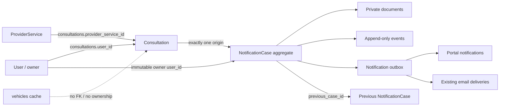
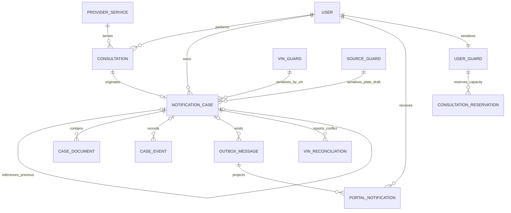
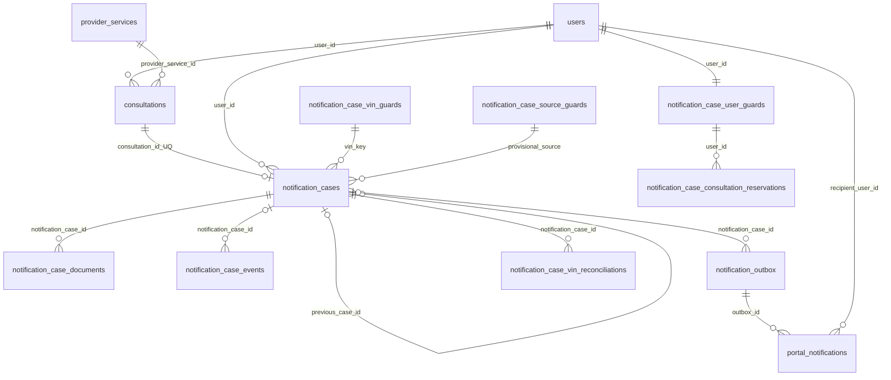
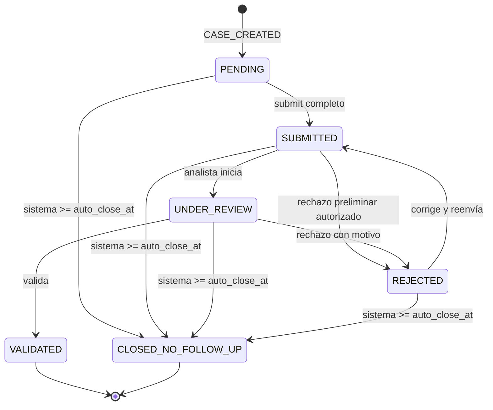

# VINTrack — SPRINT-01: Domain & Data Model Design — RESULT

**Fecha:** 2026-08-12  
**Tipo:** diseño y documentación exclusivamente  
**Estado final recomendado:** `APPROVED — OBSERVATIONS RESOLVED`  
**Implementación:** NO AUTORIZADA / NO REALIZADA

> Todas las estructuras, nombres, índices, servicios y flujos nuevos descritos aquí son **DISEÑO PROPUESTO — NO IMPLEMENTADO**. Este documento no es DDL ejecutable ni autoriza SPRINT-02.

---

## 1. Executive Summary

SPRINT-01 define un agregado `NotificationCase` independiente de `Consultation`. Su owner es directamente `users.id`, copiado de `consultations.user_id`; su origen es una única consulta mediante `notification_cases.consultation_id`; `vehicles` no participa como master, owner ni FK. El expediente conserva un snapshot vehicular, PK técnica y folio visible inmutable.

El diseño usa un único estado canónico con los seis valores aprobados, evidencia privada, auditoría append-only, outbox transaccional y notificación de portal read/unread. La concurrencia se resuelve con transacciones cortas, locks ordenados sobre filas estables, claves idempotentes, CAS por `lock_version` y constraints únicos portables. Nunca se mantiene una transacción durante la llamada remota al proveedor.

Se elige `SUBMITTED → UNDER_REVIEW → VALIDATED`; no se permite validación directa desde `SUBMITTED`, porque registrar el inicio de revisión hace inequívoca la responsabilidad analítica. Las reglas temporales quedan cerradas: deadline de 3 días a las 23:59:59 de la zona de negocio; cierre a `opened_at + 30 días`; reutilización de activos sin límite temporal y de validados hasta e incluyendo `validated_at + 90 días`; un auto-cerrado no bloquea un nuevo expediente, pero se referencia como anterior.

El diseño es portable entre MySQL 8.4.3 y MariaDB 10.6.27. La zona y semántica persistida oficial es `America/Mexico_City`. La retención provisional es cinco años para casos/evidencia/auditoría y dos para portal, sin purga autorizada. La opción primaria es cPanel Cron con `/usr/local/bin/php` y un comando Artisan específico futuro; HTTPS firmado es contingencia. Ninguna decisión está implementada.

---

## 2. Scope and Non-Implementation Attestation

### Alcance ejecutado

- Análisis de dominio, ownership, autorización y seguridad.
- Modelo lógico y modelo físico propuesto.
- Estados, reglas temporales, concurrencia, idempotencia, auditoría y notificaciones.
- Evidencia privada, historiales y DataTables server-side.
- Compatibilidad, Cron, futura migración, despliegue y rollback.
- Diagramas, matrices y trazabilidad.

### Fuera de alcance y no realizado

- No se creó/modificó/ejecutó migration, tabla, índice, constraint ni dato.
- No se modificó PHP, JavaScript, Blade, CSS, SQL, configuración, `.env`, dependencia, Cron o producción.
- No se creó modelo, servicio, controlador, ruta, request, policy, comando, job o endpoint.
- No se inició SPRINT-02.

La inspección de repositorio fue de solo lectura. No se conectó a producción ni se ejecutaron comandos de base de datos.

---

## 3. Evidence Reviewed

### Documentación leída completamente

- `AGENTS.md`.
- `docs/VINTRACK_MASTER_SPEC.md`.
- `docs/ARCHITECTURE.md`.
- `docs/BUSINESS_RULES.md`.
- `docs/DATA_MODEL.md`.
- `docs/DECISION_LOG.md`.
- `docs/CHANGE_REQUESTS.md`.
- `docs/PROJECT_STATE.md`.
- `docs/sprints/SPRINT-00-DISCOVERY.md`.
- `docs/sprints/SPRINT-00-RESULT.md`, incluido “Owner Review / Governance Closure”.
- `docs/sprints/SPRINT-01-DOMAIN-DATA-MODEL.md`, documento rector.

### Evidencia técnica verificada

| Hecho actual | Evidencia concreta |
|---|---|
| Arquitectura por capas | `app/Domain`, `app/Application`, `app/Infrastructure`, `app/Presentation` y `composer.json` |
| Consulta tiene owner directo | Migration `2024_07_07_120001_create_consultations_table.php`: `user_id`; modelo `Infrastructure\Persistence\Models\Consultation::user()` |
| Servicio canónico singular | Migration `2026_08_10_210000_add_provider_service_id_to_consultations_table.php`; `Consultation::providerService()`; `ConsultationRepository::save()` |
| `provider_service_id` es NOT NULL tras backfill y tiene FK RESTRICT | Pasos 5 y 6 de esa migration; índice `consultations_service_criterio_valor_created_idx` |
| Flujo actual de consulta | `Application\Consultas\Services\ConsultationService::consult()`: valida wallet, llama adapter, debita tras éxito, persiste y hace upsert |
| Endpoint actual | `POST /consult`, `Presentation\Http\Controllers\Web\ConsultationController::consult`, en `routes/web.php` |
| Relación cliente | `RoleHelper::isCustomer()` usa `User → Role → RoleType.is_customer`; `RoleHelper::isAdmin()` usa `is_admin` |
| Historial cliente actual tiene scope | `CustomerAccountController::consultations()`: `where('user_id', Auth::id())`; termina en `get()` |
| Historial admin actual carga colección completa | `AdminConsultationController::index()`: filtros, `with(['user','provider'])`, `get()` |
| DataTables actuales son cliente | `resources/views/customer/partials/datatable.blade.php` y `resources/views/admin/consultations/index.blade.php` inicializan `.DataTable()` sobre datos renderizados |
| Reporte existente autoriza owner/admin | `ReportController::authorizeConsultation()`: compara owner con `Auth::id()` o rol admin |
| Dedupe de email existente | Migration `2026_07_27_210000_create_notification_policies_and_deliveries_tables.php`: `notification_deliveries.dedup_key UNIQUE`; `CustomerMailNotificationService::send()` usa `firstOrCreate` |
| Email actual sin outbox robusto | `CustomerMailNotificationService` crea delivery y llama `Mail::send()` sin worker confirmado |
| Idempotencia precedente | Migration `2024_07_06_180004_create_wallet_ledger_table.php`: `wallet_ledger.correlation_id UNIQUE`; `LedgerRepository::findByCorrelationId()` |
| Lock precedente | `InventoryMovementService`: `DB::transaction()` y `ProviderService::lockForUpdate()` |
| Disco privado disponible | `config/filesystems.php`: disco `local` con root `storage/app/private`; no debe usarse el disco `public` para evidencia |
| Timezone actual | `config/app.php`: `'timezone' => 'UTC'` literal; no lee `APP_TIMEZONE` actualmente |
| Automatización existente | `routes/console.php`: `inventory:return-expired-credits` hourly; no prueba ejecución del scheduler en producción |
| Despliegue actual | `deploy.md`: FTP/File Manager, SQL por phpMyAdmin, caches generados localmente; sin terminal/SSH |

### Límites de evidencia

- Esquema y datos de producción: `NO DETERMINADO`; no fueron inspeccionados en este Sprint. La existencia productiva de `provider_service_id` se acepta por decisión aprobada DEC-003.
- Ruta PHP CLI aprobada documentalmente: `/usr/local/bin/php`; versión 8.3 efectiva, extensiones, acceso, permisos, frecuencia y límites requieren predeployment.
- Zona oficial: `America/Mexico_City`; el código actual UTC deberá armonizarse solo en un Sprint autorizado.
- Retención provisional aprobada sin purga: casos/evidencia/auditoría 5 años; portal 2 años; disposición final requiere validación legal/Owner.
- Los payloads por placa siguen requiriendo mappings/fixtures para extracción inequívoca; si no hay VIN, aplica la excepción controlada de asignación única antes de submit.

### Precedencia contractual aplicada

La regla histórica “solo Placas e IPH” fue sustituida documentalmente por DEC-032/CR-002. La matriz ampliada y `IPH OR NUC` son ahora la fuente armonizada.

---

## 4. Baseline Confirmed

1. Laravel 12/PHP 8.3; MySQL 8.4.3 local y MariaDB 10.6.27 productivo por baseline aprobado.
2. `consultations` es el evento histórico y contiene `user_id`, `provider_id`, `provider_service_id`, criterio, valor, resultado/flags y payload.
3. `vehicles` es cache/consolidado por `provider_service_id + valor`; no es raíz transaccional.
4. No existe entidad Cliente independiente; `User` y su `RoleType` determinan el tipo de actor.
5. No existe infraestructura integral comprobada de expediente, auditoría de dominio ni notificación de portal.
6. Existen correo, delivery/dedupe, disco privado y precedentes de transacción/lock reutilizables conceptualmente.
7. Los historiales actuales no son server-side.
8. El check futuro de tres pendientes debe insertarse antes de adapter/API, débito y cualquier consumo; no altera en este Sprint el orden normal API → débito documentado por DEC-027.

---

## 5. Ubiquitous Language and Domain Boundaries

| Término | Definición definitiva |
|---|---|
| Consultation | Evento histórico existente de consulta. Puede no originar expediente. |
| NotificationCase | Agregado documental de seguimiento que nace de una consulta calificante. |
| Owner | `User` inmutable copiado de `consultations.user_id` al crear. |
| Analyst | Usuario administrativo autorizado para revisar/rechazar/validar; nunca owner por esa función. |
| Vehicle snapshot | Datos históricos almacenados en el caso; no lectura viva de `vehicles`. |
| Pending | `status IN (PENDING,SUBMITTED,UNDER_REVIEW,REJECTED)`. |
| Applicable case | Caso activo del mismo VIN o validado aún dentro de la ventana inclusiva. |
| Evidence document | Archivo privado y su metadata relacional. |
| Audit event | Hecho append-only de negocio o seguridad. |
| Outbox message | Intención de notificación confirmada con la transacción de negocio. |
| Portal notification | Proyección por destinatario con estado read/unread. |

### Diagrama de contexto y fronteras de agregados



Invariantes del agregado:

- Un caso tiene exactamente una consulta originadora y un owner; ambos son inmutables.
- Una consulta origina como máximo un caso (`UNIQUE consultation_id`).
- Folio es siempre inmutable. VIN es inmutable desde su asignación inicial; solo el owner de un borrador por placa sin VIN recuperable puede asignarlo una vez antes de `SUBMITTED`.
- Estado general único; timestamps de transición son derivados/auditables, no estados paralelos.
- Documentos, eventos y notificaciones no se embeben como JSON fuente de verdad.
- El caso previo debe tener el mismo `vin_key`, ser anterior y no puede formar ciclos.

---

## 6. Ownership and Authorization Model

La autorización combina permiso de capacidad y scope de recurso. Nunca se autoriza por conocer `id`, folio o VIN. El query de cliente aplica `notification_cases.user_id = authenticated_user.id`; la proyección “otro usuario” parte de la consulta propia y devuelve solamente un código/etiqueta y estado público reducido.

### Matriz actor × recurso × acción × condición

| Actor | Recurso/acción | Condición server-side | Resultado |
|---|---|---|---|
| Cliente | Listar consultas | `consultations.user_id = auth.id` | Positivas y negativas propias |
| Cliente | Ver caso/detalle | `case.user_id = auth.id` y permiso de menú/capacidad | Detalle propio |
| Cliente | Capturar/editar | Owner y estado `PENDING` o `REJECTED`; `lock_version` coincide | Permitido salvo VIN/folio |
| Cliente | Asignar VIN una vez | Owner, origen PLATE, VIN NULL, estado editable, permiso `case.vin.assign_once`, lock/conciliación sin conflicto | `CASE_VIN_ASSIGNED`; después inmutable |
| Cliente | Enviar/reenviar | Owner, estado permitido, campos completos, IPH o NUC, CAS | `SUBMITTED` |
| Cliente | Cargar/eliminar documento | Owner, estado editable, máximo 8 activos, lock del caso | Permitido y auditado |
| Cliente | Descargar evidencia | Owner y documento activo/retained | Stream privado autorizado |
| Cliente | Ver auditoría | Owner; solo subconjunto de eventos/metadata no internos | Proyección segura |
| Cliente | Ver caso previo | Cada nodo de la cadena debe pertenecer al cliente; de otro modo solo indicador mínimo | No hay escalación por cadena |
| Cliente B | Estado de caso de A | B tiene una consulta propia relacionada al mismo VIN y el caso es aplicable | Solo `OTHER_USER_ACTIVE` o `OTHER_USER_RECENTLY_VALIDATED`, sin folio, owner, evidencia, fechas exactas ni notas |
| Analista | Listado/detalle global | Rol administrativo + permiso explícito de recurso | Global |
| Analista | Iniciar revisión/rechazar/validar | Permiso específico, transición válida y CAS | Permitido/auditado |
| Administrativo autorizado | Corregir campos | Permiso específico; nunca VIN/folio/owner/origin; motivo obligatorio | Diff por campo |
| Administrativo autorizado | Documentos | Permiso específico y política de retención | Carga/descarga/remoción auditada |
| Administrativo autorizado | Auditoría | Permiso `case.audit.view`; metadata sensible filtrada | Lectura |
| Administrativo | Elegir auto-cierre | Nunca | Denegado |
| Sistema Cron | Auto-cerrar/reintentar | Identidad técnica limitada, vencimiento, estado pendiente, CAS/lock | Solo acciones automatizadas |

### Catálogo conceptual de permisos y asignación

| Permiso | Cliente/Policía | Analista | Administrador Global |
|---|---:|---:|---:|
| `case.view.own`, `case.edit.own`, `case.submit` | Sí, propio | No por rol | No por rol |
| `case.document.manage.own`, `case.vin.assign_once` | Sí, propio/condicional | No | No |
| `case.view.global`, `case.edit.admin`, `case.review.start`, `case.reject`, `case.validate` | No | Sí explícito | Sí explícito |
| `case.document.manage.global`, `case.audit.view` | No; auditoría propia solo proyección autorizada | Sí explícito | Sí explícito/completo según política |
| `case.vin.reconciliation.manage` | No | Participa según permiso | Resuelve mediante procedimiento futuro auditado |
| `case.notification.supervise`, `case.automation.supervise` | No | No salvo permiso específico | Sí explícito |
| `case.configuration.manage`, `case.permissions.manage` | No | No | Sí explícito |

Estos nombres siguen la convención conceptual `recurso.acción.scope`; no están implementados ni insertados. Ningún rol puede alterar silenciosamente VIN ya asignado, folio, owner, consulta/criterio/valor, seleccionar manualmente `CLOSED_NO_FOLLOW_UP` o borrar historia sin política legal.

Defensa IDOR: route binding no sustituye policy; todo repositorio/caso de uso recibe actor y aplica scope; DataTables ignora scopes enviados por cliente; descargas resuelven documento dentro del caso autorizado; respuestas 404/403 consistentes no revelan existencia; mass assignment usa DTO/allowlist; CSRF para sesiones; rate limit para mutaciones y descargas.

---

## 7. Logical Data Model

### Entidades

- `NotificationCase`: raíz del agregado, snapshot, estado y relojes.
- `NotificationCaseDocument`: metadata de evidencia privada.
- `NotificationCaseEvent`: auditoría append-only.
- `NotificationOutbox`: intención durable para email/portal.
- `PortalNotification`: bandeja read/unread por destinatario.
- `NotificationCaseSequence`: contador anual transaccional de folios.
- `NotificationCaseUserGuard`: fila estable por usuario para serializar admisión de consultas; se crea de forma idempotente antes de uso.
- `NotificationCaseVinGuard`: fila estable por `vin_key` para serializar creación/reutilización del mismo VIN.
- `NotificationCaseSourceGuard`: guard provisional por `consultations.provider_service_id + PLATE + consultations.valor` normalizado para borradores de placa sin VIN; no duplica esas fuentes en el caso.
- `NotificationCaseVinReconciliation`: incidencia/flag auxiliar auditable ante conflicto en primera asignación; no es estado canónico ni fusiona casos.
- `NotificationCaseConsultationReservation`: reserva breve de capacidad antes de API, con TTL y token idempotente; evita que dos solicitudes con dos pendientes pasen simultáneamente.
- Configuración: reutilizar `global_configuration` si su API/tipos soportan claves; evidencia: migration `2026_07_24_200000_create_global_configuration_table.php`. No duplicar tabla de configuración.

### ERD lógico



Cardinalidades: consulta 0..1 caso; owner 0..N casos; caso 0..N documentos/eventos/outbox; caso 0..1 anterior y 0..N sucesores; outbox 0..N entregas/proyecciones según canal.

Cada `NotificationCase` puede tener cero o muchos eventos y mensajes de outbox. Cada evento o mensaje de outbox puede relacionarse con cero o un `NotificationCase`. La ausencia de expediente se permite únicamente para eventos pre-expediente incluidos en la allowlist, como `CONSULTATION_BLOCKED`. Todos los eventos y mensajes posteriores a `CASE_CREATED` requieren `notification_case_id`/`case_id` no nulo. Los documentos no admiten esta excepción: cada documento pertenece obligatoriamente a un expediente existente.

---

## 8. Proposed Physical Data Model

**DISEÑO PROPUESTO — NO IMPLEMENTADO.** Todos los `DATETIME` funcionales tienen semántica contractual `America/Mexico_City`, sin conversión implícita del motor. Usan `DATETIME(6)` cuando se requiere, salvo `notification_deadline_at DATETIME(0)` por su límite exacto a segundos. Tablas InnoDB, `utf8mb4`; claves técnicas ASCII con collation binaria/ASCII compatible.

### ERD físico propuesto con cardinalidades



### `notification_cases`

| Columna | Tipo portable | Null/default | Regla |
|---|---|---|---|
| `id` | BIGINT UNSIGNED | PK | Técnica |
| `consultation_id` | BIGINT UNSIGNED | NOT NULL | FK RESTRICT/RESTRICT, UNIQUE |
| `user_id` | BIGINT UNSIGNED | NOT NULL | FK users RESTRICT/RESTRICT; snapshot de owner |
| `previous_case_id` | BIGINT UNSIGNED | NULL | self FK RESTRICT; mismo VIN, anterior |
| `case_number` | VARCHAR(20) ASCII/binaria | NOT NULL | UNIQUE, `NT-YYYY-NNNNNN`, inmutable |
| `vin` | CHAR(17) ASCII/binaria | NULL en excepción | Automático para NIV/VIN o respuesta de placa; placa sin VIN permite primera asignación, luego inmutable |
| `vin_key` | CHAR(17) ASCII/binaria | NULL en excepción | Se asigna junto con VIN; búsqueda/guard; inmutable |
| campos funcionales | véase §9 | NULL inicialmente | Snapshot/captura |
| `status` | VARCHAR(32) ASCII | `PENDING` | seis valores; aplicación + CHECK auxiliar |
| `notification_deadline_at` | DATETIME(0) | NOT NULL | Inmutable, semántica `America/Mexico_City`, precisión de segundos |
| `opened_at` | DATETIME(6) | NOT NULL | Instante de creación |
| `auto_close_at` | DATETIME(6) | NOT NULL | `opened_at + config días`, inmutable |
| `submitted_at` | DATETIME(6) | NULL | Primera presentación; no se borra |
| `last_submitted_at` | DATETIME(6) | NULL | Reenvío más reciente |
| `review_started_at` | DATETIME(6) | NULL | Primera revisión |
| `rejected_at` | DATETIME(6) | NULL | Rechazo más reciente |
| `validated_at` | DATETIME(6) | NULL | Terminal validado |
| `closed_at` | DATETIME(6) | NULL | Terminal auto-cerrado |
| `lock_version` | BIGINT UNSIGNED | 0 | CAS; incrementa por mutación |
| `creation_key` | VARCHAR(128) ASCII | NOT NULL | UNIQUE, idempotencia de creación |
| `created_at`,`updated_at` | DATETIME(6) | NOT NULL | Semántica `America/Mexico_City` |

FK de consulta y owner son `RESTRICT`, no cascade, para preservar historia. Si el borrado actual de `users`/`consultations` choca con estas FK, la aplicación debe impedirlo o adoptar anonimización; no se permite perder casos. `previous_case_id` es RESTRICT; no cascade. `ON UPDATE RESTRICT` en todas.

Para `notification_case_events`, la FK nullable `notification_case_id` usa `RESTRICT`. Cuando sea `NULL`, el evento debe pertenecer a la allowlist de hechos legítimos previos al expediente y conservar `actor_user_id`, `event_key`, `correlation_id`, `event_type`, `occurred_at`, metadata limitada y `request_key` cuando corresponda. `CONSULTATION_BLOCKED` tiene aquí su única ubicación canónica; no se duplica en otra tabla de auditoría. `notification_outbox.case_id` puede ser `NULL` exclusivamente para el mensaje derivado de uno de esos hechos pre-expediente permitidos. Todo evento y mensaje posterior a `CASE_CREATED` exige respectivamente `notification_case_id` y `case_id` no nulos a nivel de dominio, con CHECK auxiliar portable si las pruebas cruzadas lo permiten. `notification_case_documents.notification_case_id` permanece siempre `NOT NULL`.

Índices: UQ `consultation_id`, UQ `case_number`, UQ `creation_key`; `(vin_key,status,validated_at,opened_at,id)` para aplicabilidad; `(user_id,status,id)` para pendientes/listado; `(status,auto_close_at,id)` para Cron; `(user_id,created_at,id)` para admin/owner; `(previous_case_id)`.

No se usa `ENUM`: VARCHAR facilita evolución y despliegue portable. El CHECK de allowlist es defensa adicional, pero la migration futura debe verificar comportamiento en ambos motores; la invariancia primaria vive en enum PHP/servicio y tests, no exclusivamente en CHECK.

### Tablas auxiliares

| Tabla | Columnas esenciales | Constraints/índices | Retención/locks |
|---|---|---|---|
| `notification_case_documents` | `id`, `notification_case_id`, `uploaded_by_user_id`, `original_name` VARCHAR(255), `storage_disk` VARCHAR(32), `storage_key` VARCHAR(255), `mime_type` VARCHAR(64), `extension` VARCHAR(8), `size_bytes` BIGINT, `sha256` CHAR(64) ASCII, `removed_at`, `removed_by_user_id`, timestamps | UQ `(storage_disk,storage_key)`; index `(case_id,removed_at,id)`; FKs case/uploader/remover RESTRICT o actor nullable según retención aprobada | Lock del caso antes de contar/cargar; soft removal; binario se retiene hasta política aprobada |
| `notification_case_events` | `id`, `notification_case_id` NULL, `event_key` VARCHAR(191), `event_type` VARCHAR(64), `actor_user_id` NULL, `actor_type` VARCHAR(32), `occurred_at`, `from_status`, `to_status`, `reason` TEXT NULL, `ip_address` VARCHAR(45), `user_agent` VARCHAR(512), `correlation_id` VARCHAR(128), `request_key` VARCHAR(128) NULL, `parent_correlation_id`, `field_name` VARCHAR(64), `old_value` TEXT, `new_value` TEXT, `metadata` JSON/TEXT | UQ `event_key`; `(notification_case_id,occurred_at,id)`; `(actor_user_id,event_type,occurred_at,id)`; `(event_type,occurred_at,id)` | Append-only; sin `updated_at`; sin DELETE/CASCADE. `notification_case_id` solo puede ser NULL para hechos previos legítimos como `CONSULTATION_BLOCKED` |
| `notification_outbox` | `id`, `case_id` NULL para bloqueo, `recipient_user_id`, `event_type`, `channel` (`EMAIL`,`PORTAL`), `dedup_key` VARCHAR(191), `payload` JSON/TEXT, `available_at`, `status`, `attempts`, `locked_at`, `locked_by`, `sent_at`, `failed_at`, `last_error`, timestamps | UQ `dedup_key`; `(status,available_at,id)`; FKs RESTRICT | Creada en misma transacción de negocio; claim por lock corto |
| `portal_notifications` | `id`, `outbox_id`, `recipient_user_id`, `case_id` NULL, `type`, `title`, `body`, `action_path` NULL, `read_at`, `created_at` | UQ `outbox_id`; `(recipient_user_id,read_at,created_at,id)` | No contiene datos privados de otro owner |
| `notification_case_sequences` | `year` SMALLINT PK, `last_value` BIGINT UNSIGNED, `updated_at` | PK year | `SELECT FOR UPDATE`, incrementa; huecos aceptados |
| `notification_case_user_guards` | `user_id` PK/FK, timestamps | PK/FK users RESTRICT | Mutex estable por usuario |
| `notification_case_vin_guards` | `vin_key` CHAR(17) PK binaria, timestamps | PK | Mutex estable por VIN |
| `notification_case_source_guards` | `source_key` VARCHAR(191) ASCII PK, timestamps | PK; hash/codificación determinista de service+PLATE+plate | Mutex provisional; no fuente duplicada de criterio/valor |
| `notification_case_vin_reconciliations` | `id`, `notification_case_id`, `conflicting_case_id`, `status` auxiliar, `detected_at`, `resolved_at`, `resolved_by_user_id`, `reason`, timestamps | UQ de incidencia abierta por par; FKs RESTRICT | Incidencia auxiliar, no séptimo estado; resolución futura autorizada/auditada |
| `notification_case_consultation_reservations` | `id`, `user_id`, `request_key`, `expires_at`, `consumed_at`, timestamps | UQ `request_key`; `(user_id,expires_at,consumed_at)` | Cuenta junto a pendientes; TTL corto; no implica cobro |

### Folio

- Formato: `NT-2026-000001`, 14 caracteres; `VARCHAR(20)` deja evolución sin cambiar columna.
- Secuencia anual de seis dígitos (capacidad 999,999/año). Antes de agotarse, Owner debe aprobar ampliar anchura; no wrap.
- Dentro de la transacción de creación se bloquea/inicializa la fila del año, incrementa y forma folio; UQ es última defensa. Nunca `MAX(id)+1`.
- Rollback revierte el contador cuando todo está en la misma transacción; deadlock/reintento puede dejar hueco si una futura estrategia reserva fuera de ella. Los huecos son válidos, nunca se reutilizan y no alteran auditabilidad.
- `creation_key` y UQ `consultation_id` hacen que un reintento recupere el mismo caso/folio.
- Funciona con row locks InnoDB y tipos comunes en ambos motores.

### Configuración central propuesta

Reutilizar `global_configuration` tras verificar su API. Claves: `notification_case.deadline_days=3`, `max_open_days=30`, `reuse_days=90`, `max_pending=3`, `max_files=8`, `max_file_bytes=3145728`, `reminder_hours_before` y `cron_batch_size`. Los valores efectivos usados al crear se materializan en deadlines del caso; cambios futuros no reescriben casos existentes.

---

## 9. Field Dictionary and Validation Rules

`NULL` se permite en borrador salvo automático. Enviar valida atómicamente toda la fila. Longitudes cuentan caracteres después de trim/normalización. Textos capturables son allowlist y se normalizan (§10).

| # | Campo físico | Tipo | Envío | Validación | Cliente | Admin |
|---:|---|---|---|---|---|---|
| 0 | `case_number` | VARCHAR(20) ASCII | automático | patrón y UQ | lectura | lectura |
| 1 | `vin` | CHAR(17) ASCII NULL | sí antes de submit | Automático desde `valor` para NIV/VIN o mapper para placa; si placa sin VIN, owner asigna una vez; 17, `[A-HJ-NPR-Z0-9]`, sin I/O/Q; luego inmutable | lectura o asignación única | lectura; conciliación excepcional futura |
| 2 | `recovery_place` | VARCHAR(191) | sí | texto funcional | editable | corrige auditado |
| 3 | `country` | VARCHAR(100) | sí | texto libre, no catálogo | editable | corrige auditado |
| 4 | `state` | VARCHAR(100) | sí | texto libre | editable | corrige auditado |
| 5 | `municipality` | VARCHAR(150) | sí | texto libre | editable | corrige auditado |
| 6 | `neighborhood` | VARCHAR(150) NULL | no | texto libre | editable | corrige auditado |
| 7 | `postal_code` | VARCHAR(16) NULL | no | alfanumérico/espacio/guion; no entero | editable | corrige auditado |
| 8 | `street` | VARCHAR(191) NULL | no | texto funcional | editable | corrige auditado |
| 9 | `street_number` | VARCHAR(32) NULL | no | alfanumérico | editable | corrige auditado |
| 10 | `recovered_at` | DATETIME(6) | sí | Debe ser una fecha/hora válida. La política sobre fechas futuras queda `NO DETERMINADA` y requiere decisión del Project Owner antes de convertirla en validación de negocio | editable | corrige auditado |
| 11 | `license_plate` | VARCHAR(20) | sí | alfanumérico/guion; país puede variar | editable | corrige auditado |
| 12 | `make` | VARCHAR(100) | sí | texto | editable | corrige auditado |
| 13 | `model` | VARCHAR(100) NULL | no | texto | editable | corrige auditado |
| 14 | `model_year` | SMALLINT UNSIGNED | sí | 1886..año actual+1 | editable | corrige auditado |
| 15 | `engine_number` | VARCHAR(64) NULL | no | identificador textual normalizado; letras mayúsculas sin diacríticos, números y solo puntuación permitida | editable | corrige auditado |
| 16 | `color` | VARCHAR(64) NULL | no | texto | editable | corrige auditado |
| 17 | `origin` | VARCHAR(100) | sí | texto | editable | corrige auditado |
| 18 | `authority` | VARCHAR(191) | sí | texto | editable | corrige auditado |
| 19a | `iph` | VARCHAR(100) NULL | condicional | requerido si NUC vacío | editable | corrige auditado |
| 19b | `nuc` | VARCHAR(100) NULL | condicional | requerido si IPH vacío | editable | corrige auditado |
| 20 | `investigation_file` | VARCHAR(150) | sí | texto/identificador | editable | corrige auditado |
| 21 | `safekeeping` | VARCHAR(191) | sí | texto | editable | corrige auditado |
| 22 | `inventory` | VARCHAR(150) NULL | no | texto/identificador | editable | corrige auditado |
| 23 | `notes` | TEXT NULL | no | máximo 4000 caracteres; visible a owner y admin; notas internas deben usar mecanismo separado, no este campo | editable | corrige auditado |
| 24 | documentos | relación | no | PDF/JPEG/PNG; 3 MB; 8 activos | por estado | por permiso |
| 25 | `status` | VARCHAR(32) | sistema | seis valores | no asigna | solo transición |

`recovered_at` se ingresa, persiste, recupera y muestra con semántica `America/Mexico_City`. Origen canónico: `niv`/`vin` (case-insensitive) → VIN desde `consultations.valor`; `placa` → PLATE y VIN desde mapper si es inequívoco. Si placa no devuelve VIN, la consulta positiva puede crear borrador con `vin`/`vin_key` NULL y el owner lo asigna una vez antes de `SUBMITTED`. `case_number` no tiene excepción.

Protección IPH/NUC: invariant de dominio + validación transaccional al enviar. Un CHECK portable `iph IS NOT NULL OR nuc IS NOT NULL` no puede aplicarse a borradores incompletos; por eso no corresponde en la tabla sin condicionar por estado. Puede proponerse CHECK condicional por `status`, pero no será única defensa y se habilitará solo tras prueba cruzada.

---

## 10. Text Normalization Policy

Fuente de verdad: normalizador server-side obligatorio aplicado al DTO antes de validación final y persistencia; UI solo previsualiza. Todos los campos textuales capturables se persisten en mayúsculas, sin acentos y sin diéresis.

Orden determinista:

1. Validar UTF-8 y rechazar bytes/control characters no permitidos.
2. Unicode NFD/NFKD compatible mediante biblioteca PHP disponible y probada.
3. Eliminar marcas diacríticas: `Ñ→N`, `Ü→U`, acentos→letra base.
4. Convertir a mayúsculas con semántica Unicode.
5. Sustituir whitespace Unicode por espacio ASCII, colapsar repeticiones y trim.
6. Preservar puntuación permitida por campo; rechazar caracteres no permitidos en identificadores.
7. Validar longitud y semántica después de normalizar.

Aplica obligatoriamente a `recovery_place`, `country`, `state`, `municipality`, `neighborhood`, `postal_code`, `street`, `street_number`, `license_plate`, `make`, `model`, `engine_number`, `color`, `origin`, `authority`, `iph`, `nuc`, `investigation_file`, `safekeeping`, `inventory` y `notes`. En identificadores —placas, número de motor, IPH, NUC, carpeta e inventario— convierte letras a mayúsculas, elimina acentos y diéresis, preserva números y conserva únicamente la puntuación permitida por la validación específica del campo, sin alterar su estructura significativa. Ejemplos: `Ángel Núñez → ANGEL NUNEZ`; `ABC-ü123 → ABC-U123`.

No aplica a nombre original de archivos, MIME types, storage paths/keys, hashes, metadata técnica, folio, fechas, números, booleanos, secretos ni tokens. VIN usa un normalizador específico y termina en mayúsculas ASCII: trim, validación estructural de 17 caracteres, patrón y exclusión de I/O/Q; permanece inmutable. No se usa función SQL dependiente del motor.

Casos de prueba futuros: `Ángel Núñez → ANGEL NUNEZ`, `pingüino → PINGUINO`, espacios Unicode, strings vacíos tras trim, emoji/control, `ß`, caracteres no latinos, nombres de archivo intactos y VIN con I/O/Q rechazado.

---

## 11. Canonical State Machine



Decisión: se rechaza `SUBMITTED → VALIDATED` directo. `UNDER_REVIEW` es obligatorio antes de validar. Se conserva `SUBMITTED → REJECTED` para rechazo de completitud evidente sin representar falsamente una revisión iniciada. El único cierre canónico es `CLOSED_NO_FOLLOW_UP`; no existen `validation_status`, `notified_status`, `status_notificado`, booleans canónicos ni reapertura desde estados terminales.

### Proyecciones administrativas deterministas

Estas columnas se derivan exclusivamente del valor actual de `notification_cases.status`. No se persisten, no son editables y no constituyen fuentes de verdad paralelas. `submitted_at`, `last_submitted_at`, `CASE_SUBMITTED` y `CASE_RESUBMITTED` preservan historia, pero nunca calculan el valor actual.

| Estado canónico | Status Notificado por Cliente | Status Validado por el Analista |
|---|---|---|
| `PENDING` | `NO` | `NO` |
| `SUBMITTED` | `SI` | `NO` |
| `UNDER_REVIEW` | `SI` | `NO` |
| `REJECTED` | `NO` | `NO` |
| `VALIDATED` | `SI` | `SI` |
| `CLOSED_NO_FOLLOW_UP` | `NO` | `NO` |

`Status Notificado por Cliente = SI` significa que el expediente está actualmente presentado, en revisión o validado. Al rechazar, el estado cambia a `REJECTED` y la proyección cambia automáticamente a `NO`; al reenviar, cambia a `SUBMITTED` y vuelve a `SI`. `Status Validado por el Analista = SI` únicamente para `VALIDATED`.

| Origen | Acción | Actor | Destino | Precondiciones | Efectos/evento |
|---|---|---|---|---|---|
| ∅ | crear | Sistema | PENDING | positiva, owner elegible, no aplicable, reservations/locks, idempotencia | snapshot/deadlines/folio; `CASE_CREATED` |
| PENDING | guardar | Owner | PENDING | editable, versión | normaliza, incrementa versión; `CASE_DRAFT_UPDATED` |
| PENDING | enviar | Owner | SUBMITTED | formulario completo + IPH/NUC, versión | `submitted_at` y `last_submitted_at`; `CASE_SUBMITTED` |
| SUBMITTED | iniciar revisión | Analista | UNDER_REVIEW | permiso, versión | `review_started_at`; `CASE_REVIEW_STARTED` |
| SUBMITTED | rechazar | Analista | REJECTED | permiso, motivo, versión | `rejected_at`; `CASE_REJECTED`, habilita edición |
| UNDER_REVIEW | rechazar | Analista | REJECTED | permiso, motivo, versión | `CASE_REJECTED` + `CASE_REOPENED_FOR_EDITING` en misma correlación |
| UNDER_REVIEW | validar | Analista | VALIDATED | permiso, versión, controles completos | `validated_at`; `CASE_VALIDATED`; puede liberar bloqueo |
| REJECTED | guardar | Owner | REJECTED | versión | diff; `CASE_DRAFT_UPDATED` |
| REJECTED | reenviar | Owner | SUBMITTED | formulario completo, versión | deadline no cambia; `last_submitted_at`; `CASE_RESUBMITTED` |
| Estado pendiente | auto-cerrar | Sistema | CLOSED_NO_FOLLOW_UP | `now >= auto_close_at`, CAS | `closed_at`; `CASE_AUTO_CLOSED`; puede liberar bloqueo |
| Cualquier no terminal | corregir campo | Admin | igual | permiso, motivo, campo permitido, versión | evento `ADMIN_FIELD_CORRECTED` por campo |
| VALIDATED/CLOSED_NO_FOLLOW_UP | mutar | cualquiera | — | terminal | denegado; correcciones posteriores requieren CR aprobada |

Cada transición bloquea el caso o ejecuta `UPDATE ... WHERE id=? AND status=? AND lock_version=?`; exactamente una gana. Evento y outbox se insertan en la misma transacción.

---

## 12. Temporal Rules: 3 / 30 / 90 Days

### 3 días

- Ancla: `consultations.created_at`, interpretado según la política temporal vigente.
- Se interpreta y persiste bajo `America/Mexico_City`, se suman 3 días calendario y se fija exactamente `23:59:59` en `notification_deadline_at DATETIME(0)`.
- Ejemplo obligatorio: consulta `2026-08-11 14:00:00` local → fecha límite `2026-08-14 23:59:59` local.
- La evaluación normaliza el reloj de aplicación a precisión de segundos antes de comparar: vigente si `now <= notification_deadline_at`; vencido si `now > notification_deadline_at`. Los microsegundos internos nunca adelantan el vencimiento.
- Deadline es inmutable. Rechazo/reenvío no lo cambian.
- Al vencer no cambia el estado: se deriva `deadline_overdue=true`, se restringe/advierte según política futura, pero el owner aún puede completar hasta auto-cierre. No se inventa estado.

### 30 días

- Ancla: `opened_at` del caso.
- Límite: `auto_close_at = opened_at + 30 días calendario` en `America/Mexico_City`, persistido con la misma semántica.
- Condición inclusiva: reloj de aplicación `America/Mexico_City >= auto_close_at` y estado pendiente.
- No reinicia por envío, revisión, rechazo o reenvío.
- Cierre solo sistema, idempotente y auditado.

### 90 días

- Activo/pending del mismo `vin_key`: siempre se reutiliza/no crea otro, aun si superó 90 días temporalmente; el Cron debe cerrarlo cuando corresponda, pero una carrera se resuelve bajo lock.
- `VALIDATED`: ancla `validated_at`; `new_consultation_at <= validated_at + 90 días calendario` bloquea/reutiliza. Solo `>` permite nuevo.
- `CLOSED_NO_FOLLOW_UP`: no bloquea nueva creación; el nuevo caso referencia el cerrado más reciente mediante `previous_case_id`.
- Si el previo validado ya está fuera de ventana, el nuevo referencia el caso más reciente del VIN.
- Toda comparación se hace consistentemente en `America/Mexico_City`, sin doble conversión. La cadena solo apunta hacia atrás y se valida mismo VIN + `previous.opened_at < current.opened_at`.

---

## 13. Case Creation and Previous-Case Rules

Identidad de origen: `consultations.id/user_id/provider_service_id/criterio/valor`; no se duplican `source_criterion`, `source_value` ni `notification_cases.provider_service_id`. `niv`/`vin` se normalizan a VIN y usan `valor`; `placa` se normaliza a PLATE y usa mapper. Sin VIN inequívoco, la identidad provisional es service + PLATE + placa normalizada y el owner puede asignar VIN una vez. Limitación: placas diferentes no se correlacionan con certeza hasta conocer VIN.

Antes de primera asignación: lock del caso y guard VIN, búsqueda de activos/aplicables y reglas 30/90. Sin conflicto, asignar `vin`/`vin_key`, emitir `CASE_VIN_ASSIGNED` idempotente y volverlos inmutables. Con conflicto, impedir submit, abrir `notification_case_vin_reconciliations`, conservar ambos historiales y requerir resolución Global Admin auditada; no merge/delete automático ni séptimo estado.

```mermaid
sequenceDiagram
    actor Client
    participant G as AdmissionGuard
    participant API as Provider
    participant C as consultations
    participant V as VIN guard/cases
    participant N as NotificationCase
    Client->>G: request_key + consult request
    G->>G: lock user guard; pending + live reservations
    alt total >= 3
        G-->>Client: blocked before credit/API
    else capacity
        G->>G: create idempotent short-lived reservation; commit
        Client->>API: existing provider flow (no DB transaction held)
        API-->>Client: response
        Client->>C: existing debit/persistence only as authorized flow
        alt not qualifying
            Client->>G: consume/release reservation
        else qualifying
            alt VIN available from NIV/VIN or provider
                Client->>V: lock VIN guard; find applicable/latest
            else PLATE without VIN
                Client->>V: lock provisional source guard; create VIN-null draft
            end
            alt applicable VIN case exists
                V->>G: consume reservation; keep owner
                V-->>Client: safe existing-case projection
            else create allowed
                V->>N: case(owner=C.user_id, snapshot, previous, folio, VIN nullable only for PLATE exception)
                N->>G: consume reservation; audit + outbox; commit
            end
        end
    end
```

La reserva de admisión se cuenta como cupo potencial. Con 2 pendientes, la primera solicitud deja `2+1=3`; la segunda observa 3 bajo el mismo user guard y se bloquea. La reserva expira si no llega resultado, se consume al finalizar y se limpia idempotentemente. No cobra ni invoca proveedor.

Después de API, la creación toma locks en orden: user guard → VIN guard → caso aplicable/anterior → sequence row → inserciones. Si la reserva expiró, se revalida cupo bajo user guard; si ya no hay cupo, el resultado de consulta se conserva, pero no se crea un cuarto caso y se genera alerta operativa `NO DETERMINADO` para resolución. SPRINT-02 debe hacer que TTL cubra el timeout máximo del proveedor y renovar de forma limitada sin mantener transacción.

Regla de selección del anterior: el caso con mismo VIN y mayor `(opened_at,id)` anterior al nuevo, sin importar estado, siempre que no sea el propio; se asigna una sola vez. Navegación se autoriza nodo por nodo.

```mermaid
sequenceDiagram
    actor Client
    participant App
    participant Case
    participant Event
    Client->>App: reenviar rejected + idempotency key + version
    App->>Case: lock/CAS REJECTED, validate all fields
    alt valid and version wins
        App->>Case: status=SUBMITTED; version++ (deadline unchanged)
        App->>Event: CASE_RESUBMITTED once
        App-->>Client: same id/case_number
    else duplicate key
        App-->>Client: prior successful result
    else conflict
        App-->>Client: 409 current state/version
    end
```

---

## 14. Concurrency and Idempotency Design

Orden global de locks: user guard → VIN guard → notification case → annual sequence → documents/outbox. Operaciones que no requieren una dimensión omiten el lock, pero nunca invierten el orden. Transacciones cortas; aislamiento `READ COMMITTED` propuesto para reducir gap locks, sujeto a prueba; retry de deadlocks/lock timeout con jitter, máximo 3, solo si la operación tiene key idempotente.

| Carrera | Key/constraint final | Locks/transacción | Ganador/perdedor y reintento | Evento único |
|---|---|---|---|---|
| 2 pendientes + 2 consultas | `reservations.request_key UQ` | user guard; count pending + live reservations | primera reserva; segunda bloqueada; retry devuelve reserva/bloqueo previo | `CONSULTATION_BLOCKED` con correlation UQ |
| Mismo VIN, dos usuarios | `vin_guard PK`, `consultation_id UQ`, `creation_key UQ` | VIN guard y casos aplicables | uno crea; otro referencia proyección, owner no cambia | `CASE_CREATED` una vez |
| Misma placa sin VIN / asignación VIN | source guard PK + request key; VIN guard | source guard al crear; case→VIN guard al asignar, consulta aplicables | evita duplicado provisional; conflicto crea una sola incidencia y bloquea submit | `CASE_VIN_ASSIGNED` o reconciliación, nunca ambos silenciosamente |
| Doble submit | request key + CAS `(status,lock_version)` | caso | primero transiciona; segundo obtiene resultado previo o 409 | `CASE_SUBMITTED` UQ |
| Doble transición admin | correlation key + CAS | caso | una transición; otra 409/idempotent replay | evento por transición una vez |
| Validación vs auto-cierre | CAS de estado/version | caso | quien bloquea/CAS primero gana; el otro ve terminal y no actúa | solo VALIDATED o AUTO_CLOSED |
| Dos Cron | UQ evento/dedup + claim | lotes de casos `FOR UPDATE`, pequeños | uno reclama; otro salta/observa terminal | `CASE_AUTO_CLOSED` una vez |
| Doble notificación | `outbox.dedup_key UQ`, delivery `dedup_key UQ` | inserción negocio; claim delivery | una fila; retry reanuda estado | queued/sent/fail controlado |
| Doble folio | PK year + UQ case_number | sequence row | serializado; retry carga caso por creation key | CASE_CREATED guarda folio |
| Timeout desconocido | request/correlation key UQ | lookup antes de repetir | devuelve recurso/resultado ya confirmado; nunca repite side effect | mismo correlation |
| 9.º archivo simultáneo | UQ storage key + case lock | lock caso, count activos, insert | una carga ocupa octavo; otra 422 | upload solo ganador |

No se reutiliza `wallet_ledger.correlation_id`; solo su patrón. El simple `COUNT` sin user guard/reservas queda expresamente descartado.

### Consulta bloqueada antes de consumo

```mermaid
sequenceDiagram
    actor Client
    participant Ctrl
    participant Guard
    participant Wallet
    participant Provider
    Client->>Ctrl: POST consult
    Ctrl->>Guard: acquire user guard / check pending + reservations
    alt already 3
        Guard->>Guard: audit/outbox block idempotently
        Guard-->>Ctrl: BLOCKED
        Ctrl-->>Client: 409/422 business response
        Note over Wallet,Provider: no debit, ledger, API or billable call
    else below 3
        Guard-->>Ctrl: reservation token; commit
        Ctrl->>Wallet: existing balance validation
        Ctrl->>Provider: existing provider call
    end
```

### Auto-cierre idempotente

```mermaid
sequenceDiagram
    participant CronA
    participant CronB
    participant Case
    participant Event
    participant Outbox
    CronA->>Case: batch due; lock/CAS pending
    CronB->>Case: same candidate
    CronA->>Case: CLOSED_NO_FOLLOW_UP + closed_at + version
    CronA->>Event: CASE_AUTO_CLOSED(correlation=case+deadline)
    CronA->>Outbox: dedup(case+AUTO_CLOSED+recipient+channel)
    CronA->>Case: commit
    CronB->>Case: sees terminal / 0 rows updated
    CronB-->>CronB: no duplicate effects
```

---

## 15. Document/Evidence Design

- Solo PDF (`application/pdf`), JPEG (`image/jpeg`) y PNG (`image/png`). Extensión, MIME detectado por contenido, firma mágica y decoder de imagen deben concordar.
- Máximo `3,145,728` bytes y 8 filas activas (`removed_at IS NULL`) por caso; ambos desde configuración.
- Se bloquea la fila del caso antes de contar e insertar. Solo estado `PENDING`/`REJECTED` para owner; admin según permiso explícito y política.
- Storage en disco privado `local` (`storage/app/private` comprobado) o disco privado equivalente, nunca `public`. Key aleatoria no derivada del nombre/folio/VIN; no se acepta path del cliente.
- Descarga por controlador autenticado/policy, lookup documento dentro del caso, headers seguros (`nosniff`, disposition attachment), streaming, rate limit y auditoría opcional de acceso sensible.
- Antivirus: capacidad `NO DETERMINADO`; se recomienda cuarentena/scan antes de marcar disponible si hosting lo permite. Sin scanner, impedir ejecución, servir attachment y validar firmas.
- `original_name` se conserva exacto como metadata, se limpia solo para header; nunca forma path.
- “Eliminar” marca `removed_at/by` y audita. Retención provisional: casos, documentos y auditoría 5 años; portal 2 años. El plazo no autoriza borrado: no hay purga física/automática ni anonimización hasta validación legal y aprobación del Owner. Toda disposición futura será autorizada, trazable, auditable, idempotente y preservará la cadena.
- Hash SHA-256 se calcula durante streaming y permite detectar corrupción; no deduplica evidencia entre owners.

---

## 16. Audit Design

Auditoría append-only dentro de la misma transacción que el cambio. El modelo no expone update/delete; permisos DB de producción deberían impedirlos cuando sea viable. Eventos técnicos de entrega posteriores usan correlación con el evento de negocio.

| Evento | Actor | From→To/campos | Motivo/datos mínimos |
|---|---|---|---|
| `CASE_CREATED` | sistema/request user | ∅→PENDING | origin, owner, folio, snapshot hash |
| `CASE_VIN_ASSIGNED` | owner | VIN NULL→valor válido | actor, fecha, IP, UA, procedencia, request/idempotency key; lock/conciliación previa |
| `CASE_DRAFT_UPDATED` | owner | estado igual | campos cambiados, sin secretos |
| `CASE_SUBMITTED` | owner | PENDING→SUBMITTED | versión, validation result |
| `CASE_REVIEW_STARTED` | analyst | SUBMITTED→UNDER_REVIEW | actor efectivo |
| `CASE_REJECTED` | analyst | SUBMITTED/UNDER_REVIEW→REJECTED | motivo obligatorio |
| `CASE_REOPENED_FOR_EDITING` | analyst | paired with rejection | razón/correlation padre |
| `CASE_RESUBMITTED` | owner | REJECTED→SUBMITTED | deadline original |
| `CASE_VALIDATED` | analyst | UNDER_REVIEW→VALIDATED | actor/timestamp |
| `CASE_AUTO_CLOSED` | system | pending→CLOSED_NO_FOLLOW_UP | anchor/limit/run id |
| `ADMIN_FIELD_CORRECTED` | admin | campo old→new | un evento por campo, motivo y parent correlation |
| `DOCUMENT_UPLOADED` | owner/admin | — | doc id, MIME, bytes, SHA; no binario |
| `DOCUMENT_REMOVED` | owner/admin | — | doc id, razón |
| `NOTIFICATION_QUEUED/SENT/FAILED` | system | delivery status | channel/dedup/attempt; error saneado |
| `PORTAL_NOTIFICATION_CREATED` | system | — | recipient/type/dedup |
| `CONSULTATION_BLOCKED` | user/system | — | pending count, request key; no payload proveedor |

Datos comunes: case (nullable solo para bloqueo pre-caso), actor nullable para sistema, actor type/rol efectivo, `occurred_at`, estados, IP, UA, reason, correlation y metadata limitada. No copiar contraseñas, tokens, HMAC, payload binario, response_json completo ni PII de otro owner. VIN/folio pueden figurar como referencia creada, nunca como `ADMIN_FIELD_CORRECTED`.

---

## 17. Notification Design

Decisión: reutilizar `notification_deliveries` para resultado de correo/dedupe donde su esquema encaje, pero agregar `notification_outbox` para atomicidad y `portal_notifications` para read/unread. No crear `notification_case_notifications` ambiguo. El outbox es común a canales; un worker/runner síncrono controlado por Cron procesa después del commit.

| Evento | Destinatario | Canal | Datos permitidos/condición | Dedupe conceptual |
|---|---|---|---|---|
| Caso nuevo pendiente | owner | email+portal | folio, deadline, acción propia | case+created+user+channel |
| Deadline próximo | owner | email+portal | folio, deadline; una vez por umbral | case+reminder+threshold+channel |
| Enviado | owner + analyst group autorizado | portal; email configurable | folio/status | case+submitted+submission_no+recipient+channel |
| Revisión iniciada | owner | email+portal | folio/status | case+review_started+version+channel |
| Rechazado | owner | email+portal | folio y motivo visible saneado | case+rejected+version+channel |
| Validado | owner | email+portal | folio/status | case+validated+channel |
| Auto-cerrado | owner | email+portal | folio/razón | case+auto_closed+channel |
| Consulta bloqueada | requester | portal; email opcional dedup por episodio | conteo y acceso a casos propios | user+blocked_episode+channel |
| Servicio disponible | owner que cruzó 3→2 | email+portal | mensaje genérico | user+unblocked_episode+channel |
| Caso de otro usuario | requester B | portal/in-response; email no por defecto | mensaje mínimo, sin owner/folio/evidencia | consultationB+other_case_notice+channel |

Outbox se inserta tras decidir el negocio, dentro de su transacción. Estados `PENDING/PROCESSING/SENT/FAILED`, claim con `locked_at/by`, backoff exponencial acotado y máximo configurable; fallos terminales quedan visibles a admin y auditados. Si SMTP envía pero el proceso cae antes de `sent_at`, la dedupe local evita otra fila pero no garantiza exactly-once externo: se acepta “at-least-once con dedupe”, y se recomienda Message-ID determinista si el mailer lo soporta.

Portal: `read_at NULL` significa unread; marcar leído exige recipient scope. Payload es una proyección estable, sin serializar modelos ni datos de otro owner. `action_path` es ruta relativa allowlisted, no URL arbitraria.

---

## 18. Client History / Server-side DataTables Design

Fuente base: `consultations c WHERE c.user_id = auth.id`, incluyendo éxito/fallo y positivo/negativo. LEFT JOIN a caso originado por esa consulta y, para la indicación de otro owner, a una proyección de caso aplicable por `vin_key` calculado por fuente canónica; no se devuelve la fila privada.

Contrato server-side: `draw`, `start`, `length` (máximo 100), búsqueda global acotada, filtros tipados y `order[column]` mapeado por allowlist. Respuesta: `draw`, `recordsTotal`, `recordsFiltered`, `data`. Orden por defecto/determinista `c.created_at DESC, c.id DESC`. Nunca aceptar nombre SQL, scope user o raw direction del cliente.

Columnas: fecha local, criterio, valor/VIN, make/model/year disponible, resultado robo/fraude, estado derivado, deadline local y acciones. Derivaciones:

- own pending: etiqueta “PENDIENTE PROPIO”, fondo rojo claro y texto/icono accesible;
- otro owner aplicable: etiqueta exacta “EXPEDIENTE DE NOTIFICACION EN PROCESO POR OTRO USUARIO”, azul claro; sin folio/owner/evidencia/notas;
- `VALIDATED` y `CLOSED_NO_FOLLOW_UP` muestran su etiqueta derivada; para este último puede mostrarse “CERRADO POR FALTA DE SEGUIMIENTO”. Nunca se usa otro valor de cierre ni status paralelo.

Si la vista Cliente expone “Status Notificado por Cliente” o “Status Validado por el Analista”, DataTables los calcula exclusivamente desde `notification_cases.status` mediante la matriz de §11. Son proyecciones no persistidas: el rechazo produce `NO/NO`, y el reenvío produce `SI/NO`, sin consultar timestamps ni eventos históricos.

Búsqueda por valor/VIN, criterio, rango de fecha, resultado y estado. Query cuenta sobre `consultations` y usa subquery/LEFT JOIN agregado para evitar duplicar filas; eager/select explícito evita N+1. Acciones son calculadas server-side por policy y revalidadas al ejecutar.

---

## 19. Global Admin History / Server-side DataTables Design

Solo rol administrativo y permiso explícito. Base `consultations`, LEFT JOIN `notification_cases`, owner y provider service; selects acotados, sin payload JSON. Columnas: fecha, criterio/valor/VIN, datos básicos, `Status Robo`, `Status Notificado por Cliente`, `Status Validado por el Analista`, deadline, estado canónico, owner/cliente, folio y acciones por permiso. Las dos columnas de status son proyecciones no persistidas calculadas exclusivamente con la matriz de §11 a partir de `notification_cases.status`.

Filtros tipados: folio exact/prefix, user id exact, VIN exact/prefix, placa, fecha desde/hasta, status allowlist, notificado boolean derivado por la allowlist `SUBMITTED|UNDER_REVIEW|VALIDATED`, validado boolean derivado exclusivamente por `VALIDATED`, vencido (`now_seconds > notification_deadline_at AND status pending`) y relación otro usuario. Orden determinista añade siempre `c.id` o `case.id` como tie-breaker. `length ≤ 100`; búsquedas libres se escapan y no se aplican sobre JSON/TEXT sin índice.

### Matriz índices versus queries

| Índice | Query soportada |
|---|---|
| existing `consultations(user_id)` + propuesto `(user_id,created_at,id)` | historial cliente/count/order |
| existing `consultations_service_criterio_valor_created_idx` | búsqueda por servicio/criterio/valor/fecha |
| cases UQ `(consultation_id)` | join consulta→caso sin duplicación |
| cases UQ `(case_number)` | filtro/lookup folio |
| cases `(user_id,status,id)` | pendientes por owner y acciones |
| cases `(vin_key,status,validated_at,opened_at,id)` | aplicabilidad 90 días/mismo VIN |
| cases `(status,auto_close_at,id)` | lote auto-cierre |
| cases `(notification_deadline_at,status,id)` | vencidos/recordatorios |
| cases `(license_plate,id)` | filtro admin placa |
| cases `(created_at,id)` | listado global por fecha |
| documents `(case_id,removed_at,id)` | count/lista de activos |
| events `(case_id,occurred_at,id)` | timeline audit |
| outbox `(status,available_at,id)` | delivery batch |
| portal `(recipient_user_id,read_at,created_at,id)` | bandeja/unread |

Índices finales deben validarse con `EXPLAIN` y volumen representativo en ambos motores. No se agregan índices para filtros no usados.

---

## 20. Timezone Policy

Decisión: todos los `DATETIME` funcionales del módulo se calculan, persisten, recuperan y muestran con semántica `America/Mexico_City`. `notification_deadline_at` usa `DATETIME(0)`; `recovered_at`, ciclo del caso, eventos, outbox, entregas y read timestamps usan `DATETIME(6)` cuando sea necesario. El baseline actual `config/app.php=UTC` es evidencia de una futura modificación requerida, no semántica del módulo implementada.

Laravel y el reloj de aplicación deberán configurarse explícitamente a `America/Mexico_City`; DB/Cron/browser no convierten implícitamente. APIs serializan zona/offset claro, evitan doble conversión y prueban límites de día. UTC queda rechazado como semántica persistida; solo puede usarse como formato de intercambio con conversión explícita en el boundary.

Se evita `TIMESTAMP` y dependencia de zona de sesión. Para deadline, reloj truncado a segundos y `now <= deadline` / `now > deadline`; `NOW()` de DB no decide la regla.

---

## 21. MySQL/MariaDB Compatibility Matrix

| Tema | MySQL 8.4.3 | MariaDB 10.6.27 | Decisión portable |
|---|---|---|---|
| Engine/charset | InnoDB/utf8mb4 | InnoDB/utf8mb4 | explícitos en migration futura |
| Tiempo general / deadline | DATETIME(6) / DATETIME(0) | DATETIME(6) / DATETIME(0) | semántica `America/Mexico_City`; deadline a segundos; sin conversión implícita |
| TIMESTAMP | conversión de zona/rango | diferencias de semántica/rango | no usar para reglas |
| CHECK | enforced | enforced con diferencias | defensa auxiliar; dominio/tests son primarios |
| JSON | tipo binario nativo | alias/validación LONGTEXT | payload no crítico; accessor compatible, tamaño limitado |
| ENUM | soportado | soportado con evolución distinta | VARCHAR(32)+allowlist |
| Generated/functional index | disponible con sintaxis propia | diferencias | no depender; columnas materializadas explícitas |
| Partial index | no PostgreSQL-style | no equivalente general | índices compuestos normales |
| Upsert | `ON DUPLICATE KEY` | soporta, detalles divergen | preferir insert + captura UQ/firstOrCreate probado |
| Row lock | `FOR UPDATE` | `FOR UPDATE` | filas guard estables, transacciones cortas |
| Skip locked | disponible | disponible con matices | opcional; correctness no depende de él |
| Isolation/deadlock | InnoDB | InnoDB | orden fijo + retry idempotente |
| utf8mb4 index length | límites modernos | compatible pero revisar row format | claves largas ≤191 o ASCII/binary |
| Collation VIN/folio | collations modernas | nombres/diferencias | CHAR/VARCHAR ASCII con collation binaria disponible comprobada en staging |
| FK names/actions | soportado | soportado | nombres ≤64, RESTRICT explícito, sin cascada histórica |
| Default expressions | capacidades amplias | diferencias | defaults simples; fechas desde aplicación |

No hay invariancia crítica basada solo en JSON, CHECK, índice funcional, generated column, ENUM ni sintaxis de upsert.

---

## 22. cPanel Cron Design

### Opción primaria

cPanel Cron invocará `/usr/local/bin/php /RUTA_ABSOLUTA_DEL_PROYECTO/artisan <comando-especifico>` y un único servicio reutilizable. No se inventan aún ruta del proyecto ni comando. Antes de producción se verifican existencia, PHP 8.3 efectivo, extensiones, acceso, permisos, frecuencia y límites. No se configura ni ejecuta aquí.

### Contingencia

Solo si CLI no es viable: `POST` HTTPS a endpoint mínimo dedicado. Firma HMAC sobre método, path, timestamp, nonce y hash del body; secreto rotatable en entorno, nunca URL/código/log. Ventana ±5 minutos, nonce UQ/TTL contra replay, TLS, rate limit/IP allowlist si estable, body vacío/versionado, respuesta 202/200 sin datos sensibles y logging de run id. Endpoint llama al mismo servicio y no expone Artisan/SQL general.

### Runner común

- Lock persistente con fila/lease (`task_name`, `locked_until`, `owner_token`) adquirido atómicamente; TTL menor que frecuencia y heartbeat acotado.
- Lotes configurables (p.ej. 100), orden `(due_at,id)`, transacción por caso o lote pequeño, cursor por última PK; timeout antes del límite hosting.
- Tareas: auto-cierre; recordatorios vencibles; claim/retry de outbox.
- Reentrada segura: estados/CAS + UQ event/dedup. Un crash deja lease expirar y reanuda.
- Observabilidad: run id, inicio/fin, duración, scanned/changed/sent/failed, último error saneado y alerta por ejecuciones ausentes/fallas repetidas.
- Frecuencia objetivo 5 minutos si hosting lo permite; si mínimo mayor, SLA se documenta. El estado se calcula por instante, no por número de ticks.

---

## 23. Future Migration and Deployment Strategy

1. Gate: Owner aprueba SPRINT-01 y autoriza Sprint de implementación.
2. Preflight read-only: versiones, engine/collation, esquema real, filas huérfanas, volumen, espacio, método de deploy y PHP CLI. Backup lógico completo y prueba de restauración.
3. Crear aditivamente guards/sequences, cases, documents, events, outbox y portal; luego índices y FKs en orden padre→hijo. No alterar/eliminar `provider_service_id` ni `vehicles`.
4. Añadir configuración central con seeds/scripts idempotentes; materializar valores al crear casos.
5. Backfill: por defecto **no crear expedientes retroactivos**; no existe regla aprobada. Solo validación de relaciones. Cualquier retroactividad requiere Owner/CR.
6. Probar migrations/rollback en MySQL 8.4.3 y staging MariaDB 10.6.27 con copia sanitizada y concurrencia.
7. Implementar detrás de feature flag solo si se confirma infraestructura; de no existir, introducirla requiere alcance aprobado. Activación por etapas: schema → writes shadow/disabled → admin → client → enforcement → Cron.
8. Producción sin SSH: paquete versionado por SFTP/File Manager y SQL idempotente revisado por phpMyAdmin, conforme `deploy.md`, solo con autorización. No migration web ni ejecutor SQL genérico.
9. Ventana de mantenimiento para DDL/FK/index según volumen; medir locks en staging. Abortar por backup no verificable, engine/version distinta, huérfanos, tiempo DDL excesivo, falta de espacio o incompatibilidad.
10. Post-deploy: schema/FK/index checks, configuración, smoke authorization, file private, creation idempotency, query plans, Cron dry-run y métricas.
11. Rollback: antes de activación, deshabilitar flag y retirar código; con datos ya creados, preferir roll-forward. No hacer `down` destructivo ni borrar evidencia/eventos. Restauración completa solo bajo plan autorizado y ventana.
12. Producción no se toca hasta que Sprint de implementación, pruebas, backup, rollback y Owner estén aprobados.

Bloqueo futuro: si no existe mecanismo seguro aprobado para aplicar DDL y no se valida phpMyAdmin/CLI con transacciones y backups, no desplegar. Alternativas a aprobar: SQL manual firmado/revisado en phpMyAdmin o soporte del hosting; nunca endpoint público.

---

## 24. Security and Privacy Analysis

| Riesgo | Control de diseño |
|---|---|
| IDOR/cross-client | owner scope en query/policy; proyección mínima de otros; 404/403 uniforme |
| Forged transition | allowlist estado/acción, permiso, CAS y evento transaccional |
| Mass assignment | DTO por acción y allowlist; VIN/folio/owner/origin excluidos |
| Evidence disclosure | disco privado, controller/policy, random key, attachment/nosniff |
| Malicious file/path traversal | MIME+magic+size, sanitized header, generated key, no ejecución |
| Admin overreach | permisos granulares, motivo y diff por campo; VIN/folio bloqueados |
| Audit tampering | append-only, RESTRICT, permisos DB, hash/backup futuro evaluable |
| Notification leakage | templates/projections por recipient; otro owner sin PII/folio |
| Replay/double submit | idempotency key, UQ, CAS, CSRF, rate limit |
| Cron endpoint abuse | prefer CLI; HMAC+nonce+timestamp+TLS+rate limit en contingencia |
| Query injection/DoS | DataTables allowlist, límites, filtros tipados, timeout y índices |
| Sensitive metadata | JSON limitado, no tokens/payloads/binarios; error saneado |
| Deletion/history loss | FKs RESTRICT, soft removal, no cascade de agregados históricos |

El sistema sigue siendo documental: estados y validación significan revisión VINTrack de la evidencia, no certificación legal ni alteración de registros oficiales.

---

## 25. Risks, Tradeoffs and Resolved Decisions

| Decisión cerrada | Alternativa rechazada | Razón/evidencia | Riesgo y validación futura |
|---|---|---|---|
| Owner directo `users` desde consulta | entidad Cliente/co-owner | contrato + modelo actual | probar roles y owner inmutable |
| FK consulta; no vehicle FK | usar `vehicles` | DEC-001/002 y cache actual | mapper VIN por adapter |
| Folio anual row-locked | `MAX+1`, UUID visible | legibilidad+concurrencia portable | capacidad anual/huecos |
| Snapshot en caso | lectura viva de cache/JSON único | historia estable | mapping provider fixtures |
| VARCHAR status | ENUM/status paralelo | portabilidad/evolución | allowlist/check/tests |
| Revisión obligatoria antes de validar | SUBMITTED→VALIDATED | auditabilidad del analista | una acción adicional UX |
| Deadline vencido derivado, sin estado | estado OVERDUE | seis estados contractuales | definir UX exacta en Sprint-02 |
| Activos siempre bloquean; validados 90; cerrados no | misma regla indiscriminada | coherencia 30/90 | pruebas frontera día 90 |
| Guards+reservas | count simple/transacción remota | carrera 2+2 y no hold API | TTL/limpieza/operación |
| Outbox + delivery existente | envío síncrono/segundo mail subsystem | atomicidad + reuse dedup | worker por Cron/at-least-once |
| Portal table propia | reutilizar delivery email | read/unread por recipient | retención provisional 2 años, sin purga |
| DATETIME local `America/Mexico_City` | UTC persistido/TIMESTAMP/conversión implícita | claridad contractual y mismo valor inicial/final | evitar doble conversión, límites de día |
| CLI Cron primaria | HTTP primaria | menor superficie | verificar Neubox |
| Soft remove documentos | delete físico inmediato | evidencia/auditoría | política legal pendiente |

---

## 26. Owner Observations Resolved and Remaining Implementation Risks

Las seis observaciones quedaron decididas: zona `America/Mexico_City`; retención provisional sin purga; `/usr/local/bin/php` primaria; identidad canónica/excepción de placa; matriz de campos armonizada; permisos conceptuales aprobados.

Riesgos de implementación aún sujetos a verificación, no a redefinición del diseño: mappings/fixtures reales por proveedor; versión/extensiones/acceso/límites efectivos del CLI; procedimiento operativo de conciliación VIN; validación legal definitiva antes de purga; compatibilidad y rendimiento en ambos motores; nombre/ruta final del comando y permisos dentro de la arquitectura dinámica. Ninguno autoriza SPRINT-02.

---

## 27. Requirement Traceability Matrix

| Requisito | Decisión | Entidad/campo/regla | Verificación futura |
|---|---|---|---|
| Separación consulta/caso | agregados distintos | `consultation_id UQ` | schema/domain tests |
| Owner de consulta | copia inmutable | `user_id` desde consultation | concurrent creation test |
| Servicio singular | navegación por consulta | `consultations.provider_service_id` | relation test |
| No vehicles master | sin FK | mapper/snapshot | schema assertion |
| PK+folio | id técnico + `NT-year-seq` | sequence + UQ | parallel allocation test |
| Snapshot/VIN | automático o asignación única por placa | nullable en borrador excepcional; `CASE_VIN_ASSIGNED`; luego inmutable | origin matrix, conflict/concurrency, mutation denial |
| Formulario | matriz exacta | columnas §9 | submit validation tests |
| IPH/NUC | OR al enviar | invariant | combinations test |
| Normalización | PHP server-side obligatoria para todo texto capturable | normalizer + validadores de puntuación por campo | todos los campos §10; `Ángel/ABC-ü123` |
| Estado único | seis strings | `status` | transition/property tests |
| 3 días | tercer día local a `23:59:59`, vigente `<=`, vencido `>` | `notification_deadline_at DATETIME(0)` inmutable; reloj truncado a segundos | `23:59:58`, `23:59:59`, `00:00:00` y reloj con microsegundos |
| 30 días | `opened_at` anchor | auto_close_at/CAS | double Cron test |
| 90 días | validated anchor inclusive | vin lock/previous | day 90/day 90+ε tests |
| Máximo 3 | pending+reservations | user guard | 2+2 race test |
| No duplicado VIN | serialized applicable lookup | vin guard/UQs | cross-user race |
| Archivos | private/3MB/8 | documents/case lock | MIME/race/IDOR tests |
| Auditoría | append-only/diffs | events | tamper/correction tests |
| Email/portal | outbox + reuse delivery | outbox/portal | crash/retry/dedupe |
| Cliente history | owner-scoped server-side | consultations user index | adversarial DataTables |
| Admin history | permission global/filter | joins/index allowlist | EXPLAIN/auth tests |
| Proyecciones Notificado/Validado | solo Estado General actual según matriz §11 | no se persisten columnas paralelas | seis estados, rechazo y reenvío |
| Auditoría pre-expediente | `notification_case_id NULL` solo para allowlist legítima | event key/actor/correlation/request key | bloqueo sin caso, dedupe y no duplicación |
| Identidad consulta | no duplicar service/criterion/value | relación `consultation_id`; NIV/VIN→VIN, placa→PLATE | schema/query assertions |
| Permisos | catálogo §6 por tres actores | capabilities server-side | role/action/IDOR matrix |
| Retención | 5/5/5/2 sin purga | logical removal only | legal gate/no purge tests |
| Timezone | `America/Mexico_City` end-to-end | DATETIME(6) general + DATETIME(0) deadline | PHP/DB/Cron/browser y day boundaries |
| Dual DB | portable subset | §21 | CI/staging both engines |
| cPanel | CLI primary/HMAC fallback | common maintenance service | hosting proof/runbook |
| Deployment | additive/backup/roll-forward | §23 | restore rehearsal |

---

## 28. Acceptance Criteria Verification

### Dominio y ownership

- [x] Consulta y expediente separados.
- [x] Owner `User` derivado de `consultations.user_id`.
- [x] Servicio por `consultations.provider_service_id` singular.
- [x] `vehicles` excluida como master/owner/FK.
- [x] Autorización IDOR por recurso/acción.

### Formulario e integridad

- [x] `id` técnico y folio único/inmutable.
- [x] Snapshot y VIN por origen: automático o NULL solo en borrador de placa, asignación única antes de submit e inmutabilidad posterior.
- [x] 25 campos funcionales con IPH/NUC separados y obligatoriedad contractual.
- [x] IPH OR NUC al enviar; borrador incompleto y submit atómico.
- [x] Normalización server-side obligatoria cubre todos los campos textuales capturables: mayúsculas, sin acentos ni diéresis, con puntuación específica preservada.
- [x] Correcciones admin salvo VIN/folio auditadas por campo.

### Estado y tiempo

- [x] Estado canónico con exactamente seis valores; el único cierre es `CLOSED_NO_FOLLOW_UP` y no existe status paralelo.
- [x] Matriz completa, rechazo/reenvío y auto-cierre.
- [x] Tres días exactamente a `23:59:59`, `DATETIME(0)`, reloj normalizado a segundos, vigente `<=` y vencido `>`; inmutable.
- [x] Cierre configurable a 30 días, automático/idempotente.
- [x] Ventana 90 días con ancla y límites exactos; `previous_case_id`.
- [x] Todos los DATETIME funcionales tienen semántica `America/Mexico_City`; UTC no es semántica persistida.

### Concurrencia e idempotencia

- [x] Bloqueo con 3 antes de crédito/API; count simple descartado.
- [x] Carrera 2+2 resuelta mediante guard/reserva.
- [x] Duplicados VIN impedidos con guard/UQ; placa sin VIN tiene guard provisional y conciliación bajo lock sin séptimo estado.
- [x] Folio, submit, transición, Cron y notificación idempotentes.
- [x] Locks, constraints, deadlocks y retries documentados.

### Evidencia, auditoría y notificaciones

- [x] PDF/JPG/PNG privado, 3 MB, 8 activos y descarga autorizada.
- [x] Path protegido y política de remoción conservadora.
- [x] Auditoría append-only con actor, estados, IP, UA, motivo y diffs; `notification_case_id` nullable únicamente para eventos pre-expediente legítimos como `CONSULTATION_BLOCKED`, sin duplicación.
- [x] Reutilización de email/dedupe existente y outbox.
- [x] Portal read/unread, dedupe/retry/no leakage.

### Portales y datos

- [x] Historial Cliente positivos/negativos y owner scope.
- [x] Indicador seguro de otro owner.
- [x] Global Admin con columnas/filtros requeridos; Notificado y Validado son proyecciones no persistidas derivadas exclusivamente del estado canónico.
- [x] Ambos server-side; índices ligados a queries.
- [x] Modelos lógico/físico completos y consistentes.

### Operación y gobernanza

- [x] Matriz MySQL/MariaDB.
- [x] Cron primario/contingencia/seguridad.
- [x] Futura migration/deployment/rollback.
- [x] Hallazgos actuales con evidencia o `NO DETERMINADO`.
- [x] No se modificó código, BD, migrations, configuración ni producción.
- [x] Cierre de gobernanza modifica únicamente los nueve documentos expresamente autorizados; no hay cambios funcionales.

**Criterios cumplidos:** 38/38 criterios verificables reproducidos de la lista contractual.  
**Pendientes del diseño contractual:** 0.  
**Observaciones del Owner:** 6/6 resueltas documentalmente. Riesgos de implementación permanecen en §26.

---

## 29. Files Modified

Archivos documentales modificados en el cierre autorizado:

```text
docs/VINTRACK_MASTER_SPEC.md
docs/ARCHITECTURE.md
docs/BUSINESS_RULES.md
docs/DATA_MODEL.md
docs/DECISION_LOG.md
docs/CHANGE_REQUESTS.md
docs/PROJECT_STATE.md
docs/sprints/SPRINT-01-DOMAIN-DATA-MODEL.md
docs/sprints/SPRINT-01-RESULT.md
```

Cada archivo contiene una regla afectada o una obligación expresa de gobernanza. `SPRINT-00-RESULT.md` se leyó como historia y no se modificó. No se alteró ningún archivo fuera de la autorización.

Pruebas funcionales: no aplican a un Sprint de diseño. Se realizaron verificaciones read-only de estructura, contenido, referencias y estado Git. No se ejecutó base de datos ni migration.

---

## 30. Sprint Conclusion and Recommendation for SPRINT-02

El diseño cierra nombres físicos, ownership, snapshot, formulario, estados, límites temporales, concurrencia, idempotencia, seguridad documental, auditoría, notificaciones, queries server-side, portabilidad y operación. Es suficientemente preciso para que un Sprint posterior prepare implementación y pruebas, únicamente después de revisión y aprobación expresa del Project Owner.

Riesgos antes de implementación/producción: mappings por proveedor, conciliación VIN, validación legal definitiva antes de purga, verificación efectiva de `/usr/local/bin/php` y límites de hosting, y pruebas dual-engine/temporales. Ninguno autoriza implementación automática.

### Owner Review / Governance Closure

**Dictamen anterior:** `APPROVED WITH OBSERVATIONS`  
**Fecha de cierre:** 2026-08-12

Observaciones y cierre:

1. Zona oficial: `America/Mexico_City`, `DATETIME` local coherente, sin conversiones implícitas.
2. Retención: 5 años casos/evidencia/auditoría; 2 años portal; sin purga autorizada.
3. Cron: `/usr/local/bin/php` primaria con Artisan específico; HTTPS firmado contingencia.
4. Identidad/VIN: fuentes en `consultations`; NIV/VIN equivalentes; placa sin VIN admite asignación única y conciliación concurrente.
5. Armonización: matriz obligatoria vigente e IPH/NUC separados; DEC-016 sustituida por DEC-032.
6. Permisos: catálogo conceptual y distribución Cliente/Analista/Administrador Global aprobados.

Las correcciones se incorporaron en CR-002 y DEC-028–DEC-034. Se conserva el dictamen anterior como trazabilidad. No hay implementación funcional.

`AGENTS.md` y `SPRINT-00-RESULT.md` no fueron modificados por prohibición/alcance. Sus frases históricas sobre VIN/Placas-IPH y hallazgos de SPRINT-00 se interpretan bajo la autoridad superior de la instrucción actual, DEC-032 y CR-002; no son reglas vigentes del diseño.

**Estado final recomendado:** `APPROVED — OBSERVATIONS RESOLVED`

SPRINT-02: **NO INICIADO / NO AUTORIZADO**.

### Attestation final obligatoria

```text
Código fuente: NO MODIFICADO
Base de datos: NO MODIFICADA
Migrations: NO CREADAS, NO MODIFICADAS, NO EJECUTADAS
Configuración/Cron: NO MODIFICADOS
Artefactos modificados: exclusivamente los nueve documentos autorizados de cierre
```

Desviaciones: ninguna.

`APPROVED — OBSERVATIONS RESOLVED`
